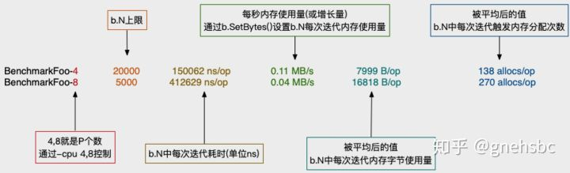
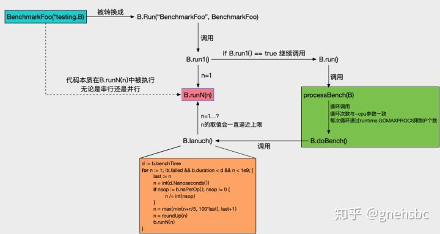

## 什么是基准测试
百度百科：基准测试是指通过设计科学的测试方法、测试工具和测试系统，实现对一类测试对象的某项性能指标进行定量的和可对比的测试。例如，对计算机CPU进行浮点运算、数据访问的带宽和延迟等指标的基准测试，可以使用户清楚地了解每一款CPU的运算性能及作业吞吐能力是否满足应用程序的要求。可测量、可重复、可对比是基准测试的三大原则，其中可测量是指测试的输入和输出之间是可达的，也就是测试过程是可以实现的，并且测试的结果可以量化表现；可重复是指按照测试过程实现的结果是相同的或处于可接受的置信区间之内，而不受测试的时间、地点和执行者的影响；可对比是指一类测试对象的测试结果具有线性关系，测试结果的大小直接决定性能的高低。

基准测试就是用来测试应用程序性能的，基准测试完成之后，更重要的是结果比对；通过比对帮我们选型做决策依据，或者帮助我们改进应用程序性能。相当优秀的程序员，必须掌握基准测试的使用。

## benchmark常用API
```azure
b.StopTimer()
b.StartTimer()
b.ResetTimer()
b.Run(name string, f func(b *B))
b.RunParallel(body func(*PB))
b.ReportAllocs()
b.SetParallelism(p int)
b.SetBytes(n int64)
testing.Benchmark(f func(b *B)) BenchmarkResult
```

## 如何做基准测试
先看一个简单的测试示例：
```azure
// fib_test.go
func fib(n int) int {
    if n == 0 || n == 1 {
        return n
    }
    return fib(n-2) + fib(n-1)
}

func Benchmark_fib(b *testing.B) {
    b.ResetTimer()
    for i := 0; i < b.N; i++ {
        fib(10)
    }
}
```

上面的代码放入fib-test.go文件中，如何运行基准测试呢？很简单，在控制台中定位到当前文件所在的目录，运行下面的代码：
```azure
go test -bench=. -run=none
```

会看到下面的结果
```azure
Benchmark_fib    4286938               274 ns/op
PASS
ok      gofast/fst/test 1.601s
```

解释一下这个命令。go test 命令默认只做单元测试，如果想做基准测试必须加上 -bench 参数，加了这个参数单元测试和基准测试都会做。如果只做基准测试不做单元测试就加上 -run=xxx 这样的参数，来告诉工具只做名称为TESTxxx的单元测试，而一般没有这样名字的单元测试函数，所以这等同于所有的单元测试都不做了。

一般我们都是对整个目录进行测试，命令最后可以加上一个当前目录 .或者干脆就不写也成。参数还有很多，我们找几个常用的说一下。
```azure
-v 				# 打印详细日志

-bench=.		# 运行所有的基准测试
-bench=_fib		# 只运行Benchmark_fib
-bench=fib$		# 匹配所有fib结尾的
-benchtime=3s	# 每一轮运行3秒
-benchtime=300x	# 循环运行300次
-cpu=2,4		# 指定GOMAXPROCS的数量，模拟多核。分别2核和4核运行一次测试
-count=3		# 运行3轮

-benchmem		# 显示堆内存分配情况，分配的越多越影响性能
```

### 串行用法
```azure
func BenchmarkFoo(b *testing.B) {
  for i:=0; i<b.N; i++ {
    dosomething()
  }
}
```
最基本用法，测试dosomething()在达到1秒或超过1秒时，总共执行多少次。b.N的值就是最大次数。

### 并行用法
```azure
func BenchmarkFoo(b *testing.B) {
	b.RunParallel(func(pb *testing.PB) {
		for pb.Next() {
			dosomething()
		}
	})
}
```

如果代码只是像上例这样写，那么并行的goroutine个数是默认等于runtime.GOMAXPROCS(0)。

创建P个goroutine之后，再把b.N打散到每个goroutine上执行。所以并行用法就比较适合IO型的测试对象。


若想增大goroutine的个数，那就使用b.SetParallelism(p int)。
```azure
// 最终goroutine个数 = 形参p的值 * runtime.GOMAXPROCS(0)
numProcs := b.parallelism * runtime.GOMAXPROCS(0)
```
要注意，b.SetParallelism()的调用一定要放在b.RunParallel()之前。

并行用法带来一些启示，注意到b.N是被RunParallel()接管的。意味着，开发者可以自己写一个RunParallel()方法，goroutine个数和b.N的打散机制自己控制。或接管b.N之后，定制自己的策略。

要注意b.N会递增，这次b.N执行完，不满足终止条件，就会递增b.N，逼近上限，直至满足终止条件。

```azure
// 终止策略: 执行过程中没有竟态问题 & 时间没超出 & 次数没达到上限
// d := b.benchTime
if !b.failed && b.duration < d && n < 1e9 {}
```
### 总结下基准测试函数编写的一些要点：

- 基准测试的代码文件必须以_test.go结尾
- 基准测试的函数必须以Benchmark开头，必须是可导出的
- 基准测试函数必须接受一个指向Benchmark类型的指针作为唯一参数
- 基准测试函数不能有返回值
- b.ResetTimer是重置计时器，这样可以避免for循环之前的初始化代码的耗时干扰
- 被测试的代码要放在for循环中，b.N是测试框架提供的，表示循环的次数，他会反复调用测试的代码，最后评估性能
### 再看两个名词解释（这两个值越小越好，证明内存利用的非常高效）：

- allocs/op 表示每个操作（单次迭代）发生了多少个不同的内存分配。
- B/op每个操作分配了多少字节。

## 基准测试对比
做基准测试的目的就是让我们做更好的决策。很多时候我们都需要创造一致的测试环境，测试不同代码的性能差异做对比，据此选出更优秀的方案。下面看一个性能比对的例子：

```azure
func BenchmarkSprintf(b *testing.B) {
	num := 10
	b.ResetTimer()
	for i := 0; i < b.N; i++ {
		_ = fmt.Sprintf("%d", num)
	}
}

func BenchmarkFormat(b *testing.B) {
	num := int64(10)
	b.ResetTimer()
	for i := 0; i < b.N; i++ {
		strconv.FormatInt(num, 10)
	}
}

func BenchmarkItoa(b *testing.B) {
	num := 10
	b.ResetTimer()
	for i := 0; i < b.N; i++ {
		strconv.Itoa(num)
	}
}
```

运行结果go test -bench=. -run=none -benchmem -benchtime=3s
```azure
BenchmarkSprintf        58911222                 62.7 ns/op            2 B/op          1 allocs/op
BenchmarkFormat         1000000000               2.15 ns/op            0 B/op          0 allocs/op
BenchmarkItoa           1000000000               2.16 ns/op            0 B/op          0 allocs/op
PASS
ok      gofast/fst/test 12.439s
```

看到性能差异了吧？运行结果很清楚的告诉我们，Sprintf的性能只能是后两种的一半，原因很大程度上值每次都发生了堆内存的分配。

## ResetTimer/StopTimer/StartTimer
这三个都是对 计时统计器 和 内存统计器 操作。

每次函数调用前后需要一些准备和清理工作，我们可以用 StopTimer 暂停计时器，再使用 StartTimer 开始计时。（操作系统内核时间只能精确到3毫秒，用这种方法能起作用吗？表示怀疑）

benchmark中难免有一些初始化的工作，这些工作耗时不希望被计算进benchmark结果中。

通常做法是
```azure
// 串行情况在for循环之前调用
init() // 初始化工作
b.ResetTimer()
for i:=0; i<b.N; i++ { dosomething() }

// 并行情况在b.RunParallel()之前调用
init() // 初始化工作
b.ResetTimer()
b.RunParallel(func(pb *testing.PB) { dosomething() })
```
剩下的StopTimer()和ResetTimer()呢？可以这样用：
```azure
init(); // 初始化工作
b.ResetTimer()
for i:=0; i<b.N; i++ { dosomething1() }
b.StopTimer()
otherWork(); // 例如做一些转换工作
b.StartTimer()
for i:=0; i<b.N; i++ { dosomething2() }
```
也可以这样用：
```azure
init(); // 初始化工作
b.ResetTimer()
for i:=0; i<b.N; i++ {
    flag := dosomething()
    if flag {
        b.StopTimer()
    } else {
        b.StartTimer()
    }
}
```
理解好这三个方法本质后灵活运用
```azure
func (b *B) StartTimer() {
	if !b.timerOn {
		// 记录当前时间为开始时间 和 内存分配情况
		b.timerOn = true
	}
}
func (b *B) StopTimer() {
	if b.timerOn {
		// 累计记录执行的时间（当前时间 - 记录的开始时间）
    // 累计记录内存分配次数和分配字节数
		b.timerOn = false
	}
}
func (b *B) ResetTimer() {
	if b.timerOn {
		// 记录当前时间为开始时间 和 内存分配情况
	}
	// 清空所有的累计变量
}
```
### b.Run()
虽然这个方法被暴露了，但其实在源码内部它是被复用的(下文原理部分介绍)。

它作用就是生成一个subbenchmark，每一个subbenchmark都被当成一个普通的Benchmark执行。

有了它，表驱动法派上用场。
```azure
func BenchmarkGCMRead(b *testing.B) {
	tests := []struct {
		keyLength   int
		valueLength int
		expectStale bool
	}{
		{keyLength: 16, valueLength: 1024, expectStale: false},
		{keyLength: 32, valueLength: 1024, expectStale: false},
    // more
	}
	for _, t := range tests {
		name := fmt.Sprintf("%vKeyLength/%vValueLength/%vExpectStale", t.keyLength, t.valueLength, t.expectStale)
		b.Run(name, func(b *testing.B) {
			benchmarkGCMRead(b, t.keyLength, t.valueLength, t.expectStale)
		})
	}
}
```
### b.SetBytes(n int)
这个API用得不多。

形参n表示在b.N次循环中，每一次循环用到了多少字节内存。

最后在benchmark输出结果中会多出MB/s这一项信息。MB/s取值公式如下：

```azure
(float64(r.Bytes) * float64(r.N) / 1e6) / r.T.Seconds()
```
意思是这次benchmark每秒大约用了多少MB的内存。


这玩意儿有啥用？个人理解，它可以大概估算堆内存增长趋势来判断GC被触发频率。

例如下面例子，dAtA这种返回值变量一般是被分配在堆上的。最后通过b.SetBytes(int64(total / b.N))来估算下每秒分配多少MB内存。

MB/s值大小的影响要结合GOGC的值来理解，默认GOGC是100，即堆内存增长一倍就被触发GC。如果MB/s值比较小，可以大概认为GC被触发频率较低；反之较高；

```azure
for i := 0; i < b.N; i++ {
    dAtA, err := github_com_gogo_protobuf_proto.Marshal(pops[i%10000])
    if err != nil {
        panic(err)
    }
    total += len(dAtA)
}
b.SetBytes(int64(total / b.N))
```

### b.ReportAllocs()
b.ReportAllocs()这个API比较简单，就是打上标记，在benchmark执行完毕后，输出信息会包括B/op和allocs/op这两项信息。

### testing.Benchmark()
默认benchmark时间(benchtime)上限是1秒，可以通过-test.benchtime来改变：
```azure
var benchTime = flag.Duration("test.benchtime", 1*time.Second, "run each benchmark for duration `d`")
```

前面提及到的终止策略中，注意b.duration < d这个条件。不论你写的benchmark运行停止时耗时是1s、1.1s还是60s，benchmark输出结果都是*/op形式，而不是以时间维度的。所以不能认为1秒最多可执行b.N次。

因此想定制benchmark输出的话，那么使用testing.Benchmark()就是最好的方式。例如想看达到b.N时，究竟花了多长时间。

# benchmark输出项含义

https://zhuanlan.zhihu.com/p/80578541

## 原理
源码太长不做介绍，以单个Benchmark举例串起流程分析下原理。



如上图，浅蓝色部分就是开发者自行编写的benchmark方法，调用逻辑按箭头方向依次递进。

B.run1()的作用是先尝试跑一次，在这次尝试中要做 竟态检查 和 当前benchmark是否被skip了​。目的检查当前benchmark是否有必要继续执行。

go test 命令有-cpu参数，用于控制benchmark分别在不同的P数量下执行。这里就对应上图绿色部分，每次通过runtime.GOMAXPROCS(n)更新P个数，然后调用B.doBench()。

核心方法是红色部分的B.runN(n)。形参n值就是b.N值，由外部传进。n不断被逼近上限，逼近策略不能过快，过快可能引起benchmark执行超时。

橙色部分就是逼近策略。先通过n/=int(nsop)来估算b.N的上限，然后再通过n=max(min(n+n/5, 100*last), last+1)计算最后的b.N。benchmark可能是CPU型或IO型，若直接使用第一次估算的b.N值会过于粗暴，可能使结果不准确，所以需要做进一步的约束来逼近。

## 并发测试
上面的基准测试都是单线程非并发的测试结果，其实还有一种模拟并发的基准测试：
```azure
func BenchmarkLoop(b *testing.B) {
	b.ReportAllocs()
	b.ResetTimer()

	// 设置并发数
	b.SetParallelism(5000)
	// 测试多线程并发模式
	b.RunParallel(func(pb *testing.PB) {
		for pb.Next() {
			loopModelFunc()
		}
	})
}
```

RunParallel并发的执行benchmark。RunParallel创建多个goroutine然后把b.N个迭代测试分布到这些goroutine上。goroutine的数目默认是GOMAXPROCS。如果要增加non-CPU-bound的benchmark的并个数，在执行RunParallel之前调用SetParallelism。

这个并发模式的测试更符合功能模块的真实场景。

参考：

https://zhuanlan.zhihu.com/p/80578541