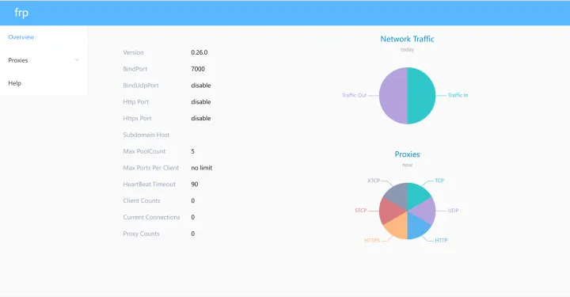

# FRP

## 网址
[源码](https://github.com/fatedier/frp)

[搭建frp实现内网穿透](https://zhuanlan.zhihu.com/p/448305084)

[搭建 frp 内网穿透以访问内网 NAS（或其他内网服务）](https://ppgg.in/10144.html)

[frp](https://gofrp.org/docs/overview/)

## 服务端搭建
### 配置frps.ini
```
# 配置开始
[common]

# frp 服务端端口（必须，客户端和它连接的端口）
bind_port = 7000

# frp 服务端密码（可以不设置）
token = 12345678

# 认证超时时间，由于时间戳会被用于加密认证，防止报文劫持后被他人利用
# 因此服务端与客户端所在机器的时间差不能超过这个时间（秒）
# 默认为 900 秒，即 15 分钟，如果设置成 0 就不会对报文时间戳进行超时验证
authentication_timeout = 900

# 仪表盘端口，只有设置了才能使用仪表盘
dashboard_port = 7500

# 仪表盘访问的用户名密码，如果不设置，则默认 admin
dashboard_user = admin
dashboard_pwd = admin
```

### 放开服务端防火墙端口
```
# 添加监听端口
sudo firewall-cmd --permanent --add-port=7000/tcp
# 添加管理后台端口
sudo firewall-cmd --permanent --add-port=7500/tcp
sudo firewall-cmd --reload
```

### 验证服务端是否启动成功
访问：http://服务器IP:后台管理端口” ，输入用户名和密码可以查看连接状态。 如：http://123.123.123.123:7500/，用户名和密码分别对应frps.ini文件中的dashboard_user和dashboard_pwd。 登录后界面如下：


如果上述步骤没有问题，则说明frp的服务端配置成功了，也就意味着内网穿透你已经成功了一半！！！

## 客户端搭建
### 配置frpc.ini
```
[common]
# 服务器公网地址
server_addr = xxx.xx.xxx.xx
# 端口
server_port = 7000
# frp 服务端密码（和frp服务器设置的一样）
token = 12345678

[ssh] #名字,自定义
# 类型
type = tcp
# 本地地址
local_ip = 127.0.0.1
# 本地端口(3389远程默认端口)
local_port = 3389
# 线上对外暴露端口(自定义但别和有用的端口冲突)
remote_port = 33891
```
根据不同，可开放多个端口
```
[common]
server_addr = x.x.x.x
server_port = 7000
token = 12345678
[rdp]  #RDP，即Remote Desktop 远程桌面，Windows的RDP默认端口是3389，协议为TCP
type = tcp
local_ip = 127.0.0.1           
local_port = 3389
remote_port = 33891 
[smb]  #SMB，即Windows文件共享所使用的协议，默认端口号445，协议TCP，本条规则可实现远程文件访问。
type = tcp
local_ip = 127.0.0.1
local_port = 445
remote_port = 33892
```