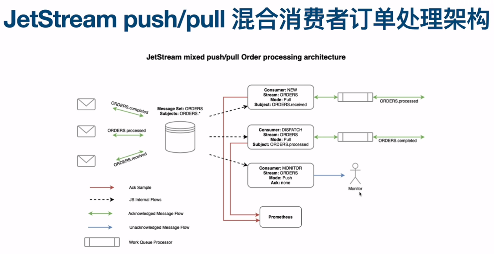
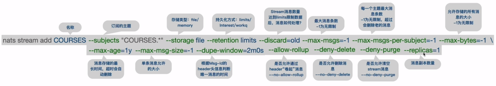
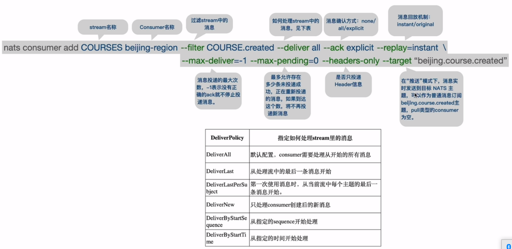
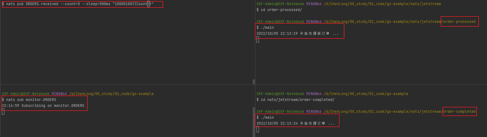
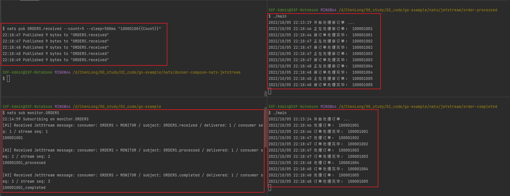

# JetStream push/pull 混合消费者订单处理架构



## nats jetstream的docker-compose
```azure
version: "3.8"

services:
  nats:
    image: 'nats:latest'
    command:
      - "--js"
    expose:
      - "4222"
    ports:
      - "4222:4222"
      - "8222:8222"
    hostname: nats-server
```
启动nats的jetstream服务，直接运行上面二代docker-compose up -d 或者~~

## 创建stream
### 创建Streamd的方法
#### 命令式创建stream


```azure
nats stream add ORDERS \
    --subjects "ORDERS.*" \
    --storage file \
    --retention limits \
    --discard=old \
    --max-msgs=-1 \
    --max-msgs-per-subject=-1 \
    --max-bytes=-1 \
    --max-age=-1 \
    --max-msg-size=-1 \
    --dupe-window=2m0s \
    --no-allow-rollup \
    --no-deny-delete \
    --no-deny-purge \
    --replicas=1
```

#### 向导式创建stream
```azure
$ nats stream add
? Stream Name ORDERS

? Stream Name ORDERS
? Subjects [? for help] ORDERS.*

? Subjects ORDERS.*
? Storage file
? Replication [? for help] (1)

? Replication 1
? Retention Policy Limits
? Discard Policy Old
? Stream Messages Limit [? for help] (-1)

? Stream Messages Limit -1
? Per Subject Messages Limit [? for help] (-1)
? Per Subject Messages Limit -1
? Total Stream Size -1
? Message TTL -1
? Max Message Size -1
? Duplicate tracking time window [? for help] (2m0s)

? Duplicate tracking time window 2m0s
? Allow message Roll-ups No
? Allow message deletion Yes
? Allow purging subjects or the entire stream Yes
Stream ORDERS was created

Information for Stream ORDERS created 2022-10-05 22:00:04

            Subjects: ORDERS.*
            Replicas: 1
             Storage: File

Options:

            Retention: Limits
     Acknowledgements: true
       Discard Policy: Old
     Duplicate Window: 2m0s
    Allows Msg Delete: true
         Allows Purge: true
       Allows Rollups: false

Limits:

    Maximum Messages: unlimited
  Maximum Per Subject: unlimited
        Maximum Bytes: unlimited
          Maximum Age: unlimited
 Maximum Message Size: unlimited
    Maximum Consumers: unlimited


State:

             Messages: 0
                Bytes: 0 B
             FirstSeq: 0
              LastSeq: 0
     Active Consumers: 0

```
## 创建消费者Consumer
### 创建消费者NEW的方法
#### 命令式创建消费者NEW


```azure
nats consumer add ORDERS NEW \
    --deliver all \
    --ack explicit \
    --replay=instant \
    --filter="ORDERS.received" \
    --max-deliver=-1 \
    --max-pending=0 \
    --no-headers-only \
    --backoff=none
```

#### 向导式创建消费者NEW
```azure
$ nats con add
? Consumer name [? for help] NEW

? Consumer name NEW
? Delivery target (empty for Pull Consumers) [? for help]

? Delivery target (empty for Pull Consumers) 
? Start policy (all, new, last, subject, 1h, msg sequence) [? for help] all

? Start policy (all, new, last, subject, 1h, msg sequence) all
? Acknowledgement policy explicit                                              
? Replay policy instant                                               
? Filter Stream by subject (blank for all) [? for help] ORDERS.received

? Filter Stream by subject (blank for all) ORDERS.received
? Maximum Allowed Deliveries [? for help] (-1)

? Maximum Allowed Deliveries -1
? Maximum Acknowledgements Pending [? for help] (0)

? Maximum Acknowledgements Pending 0
? Deliver headers only without bodies No
? Add a Retry Backoff Policy No
? Select a Stream ORDERS                               
Information for Consumer ORDERS > NEW created 2022-10-05T22:01:37+08:00
                                                                       
Configuration:                                                         
                                                                       
        Durable Name: NEW                                              
           Pull Mode: true                                             
      Filter Subject: ORDERS.received                                  
      Deliver Policy: All                                              
          Ack Policy: Explicit                                         
            Ack Wait: 30s                                              
       Replay Policy: Instant                                          
     Max Ack Pending: 1,000                                            
   Max Waiting Pulls: 512                                              

State:

   Last Delivered Message: Consumer sequence: 0 Stream sequence: 0
     Acknowledgment floor: Consumer sequence: 0 Stream sequence: 0
         Outstanding Acks: 0 out of maximum 1,000
     Redelivered Messages: 0
     Unprocessed Messages: 0
            Waiting Pulls: 0 of maximum 512
```
### 创建消费者DISPATCH的方法
#### 命令式创建消费者DISPATH
```azure
nats consumer add ORDERS DISPATCH \
    --deliver all \
    --ack explicit \
    --replay=instant \
    --filter ORDERS.processed \
    --max-deliver=-1 \
    --max-pending=0 \
    --no-headers-only \
    --backoff=none
```

#### 向导式创建消费者DISPATCH
```azure
$ nats con add
? Consumer name [? for help] DISPATCH

? Consumer name DISPATCH
? Delivery target (empty for Pull Consumers) [? for help]

? Delivery target (empty for Pull Consumers) 
? Start policy (all, new, last, subject, 1h, msg sequence) [? for help] all

? Start policy (all, new, last, subject, 1h, msg sequence) all
? Acknowledgement policy explicit                                              
? Replay policy instant                                               
? Filter Stream by subject (blank for all) [? for help] ORDERS.processed

? Filter Stream by subject (blank for all) ORDERS.processed
? Maximum Allowed Deliveries [? for help] (-1)

? Maximum Allowed Deliveries -1
? Maximum Acknowledgements Pending [? for help] (0)

? Maximum Acknowledgements Pending 0
? Deliver headers only without bodies No
? Add a Retry Backoff Policy No
? Select a Stream ORDERS                               
Information for Consumer ORDERS > DISPATCH created 2022-10-05T22:04:53+08:00
                                                                            
Configuration:                                                              
                                                                            
        Durable Name: DISPATCH                                              
           Pull Mode: true                                                  
      Filter Subject: ORDERS.processed                                      
      Deliver Policy: All                                                   
          Ack Policy: Explicit                                              
            Ack Wait: 30s                                                   
       Replay Policy: Instant
     Max Ack Pending: 1,000
   Max Waiting Pulls: 512

State:

   Last Delivered Message: Consumer sequence: 0 Stream sequence: 0
     Acknowledgment floor: Consumer sequence: 0 Stream sequence: 0
         Outstanding Acks: 0 out of maximum 1,000
     Redelivered Messages: 0
     Unprocessed Messages: 0
            Waiting Pulls: 0 of maximum 512
```

### 创建消费者NMONITOR的方法
#### 命令式创建消费者MONITOR
```azure
nats consumer add ORDERS MONITOR \
    --target monitor.ORDERS \
    --deliver all \
    --ack none \
    --replay=instant \
    --max-deliver=-1 \
    --max-pending=0 \
    --no-headers-only \
    --backoff=none
```

#### 向导式创建消费者MONITOR
```azure
$ nats con add                                                                                           
? Consumer name [? for help] MONITOR

? Consumer name MONITOR
? Delivery target (empty for Pull Consumers) [? for help] monitor.ORDERS

? Delivery target (empty for Pull Consumers) monitor.ORDERS
? Delivery Queue Group [? for help]

? Delivery Queue Group 
? Start policy (all, new, last, subject, 1h, msg sequence) [? for help] all

? Start policy (all, new, last, subject, 1h, msg sequence) all
? Acknowledgement policy none                                                  
? Replay policy instant                                               
? Filter Stream by subject (blank for all) [? for help]

? Filter Stream by subject (blank for all) 
? Idle Heartbeat [? for help] (0s)

? Idle Heartbeat 0s
? Enable Flow Control, ie --flow-control No
? Deliver headers only without bodies No
? Add a Retry Backoff Policy No
? Select a Stream ORDERS                               
Information for Consumer ORDERS > MONITOR created 2022-10-05T22:07:33+08:00

Configuration:

        Durable Name: MONITOR
    Delivery Subject: monitor.ORDERS
      Deliver Policy: All
          Ack Policy: None
       Replay Policy: Instant
        Flow Control: false

State:

   Last Delivered Message: Consumer sequence: 0 Stream sequence: 0
     Unprocessed Messages: 0
          Active Interest: No interest
```
## 处理代码
### order-processed
```azure
package main

import (
	"github.com/nats-io/nats.go"
	"log"
)

func main() {
	nc, _ := nats.Connect("localhost:4222")
	js, _ := nc.JetStream()
	log.Println("开始处理新订单 ...")
	sub, _ := js.PullSubscribe("ORDERS.received", "NEW")

	for {
		msgs, _ := sub.Fetch(100)
		for _, msg := range msgs {
			log.Println("正在处理新订单： " + string(msg.Data))
			// TODO：
			_, err := js.Publish("ORDERS.processed", []byte(string(msg.Data)+",processed"))
			if err != nil {
				log.Println(err.Error())
				continue
			}
			msg.Ack()
			log.Println("新订单处理完毕： " + string(msg.Data))
		}
	}
}
```

### order-completed
```azure
package main

import (
	"github.com/nats-io/nats.go"
	"log"
	"strings"
)

func main() {
	nc, _ := nats.Connect("localhost:4222")
	js, _ := nc.JetStream()
	log.Println("开始处理订单 ...")
	sub, _ := js.PullSubscribe("ORDERS.processed", "DISPATCH")
	for {
		msgs, _ := sub.Fetch(10)
		for _, msg := range msgs {
			orderInfo := strings.Split(string(msg.Data), ",")
			orderNo := orderInfo[0]
			log.Println("处理订单： " + orderNo)
			// TODO：
			_, err := js.Publish("ORDERS.completed", []byte(orderNo+",completed"))
			if err != nil {
				log.Println(err.Error())
				continue
			}
			log.Println("订单处理完毕： " + orderNo)
			msg.Ack()
		}
	}
}
```
## 验证测试
### push消费者monitor监控
```azure
nats sub monitor.ORDERS
```
### push生产者received
```azure
nats pub ORDERS.received --count=5 --sleep=1s "10000{{Count}}"
```


---

