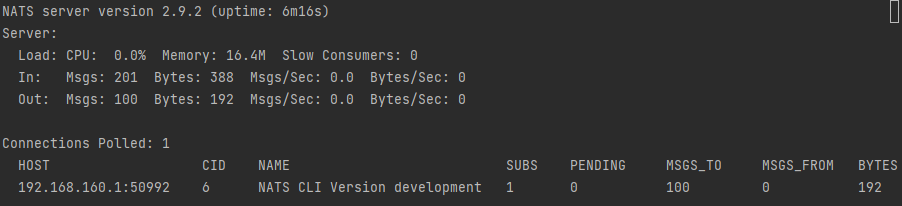

# nats-top的使用

## 安装

```azure
# https://github.com/nats-io/nats-top
go install github.com/nats-io/nats-top@latest
```

## 使用
### 执行docker-compose
```azure
docker-compose up -d
```
### 执行nats-top
```azure
$nats-top
```

```azure
$ nats pub hello --count=100 --sleep=500ms "{{Count}}"
```

```azure
$ nats sub hello
```

