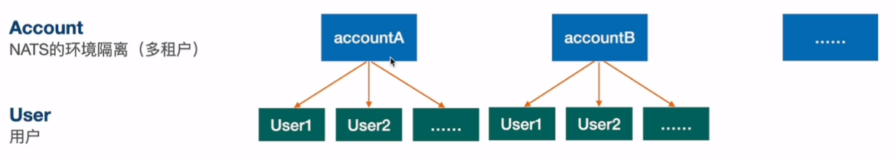
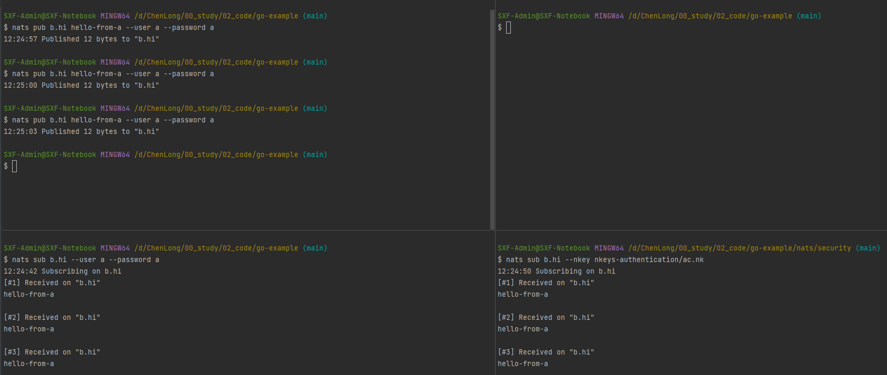
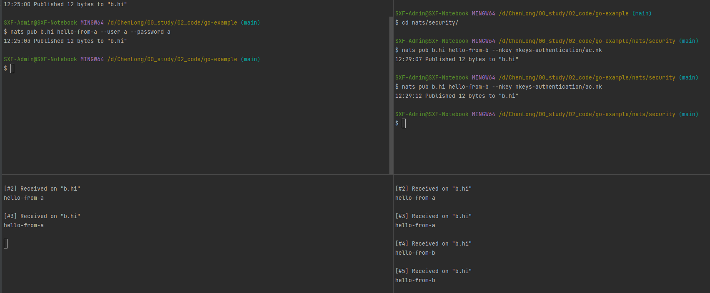
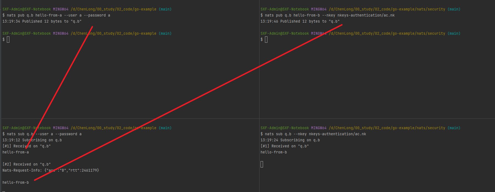
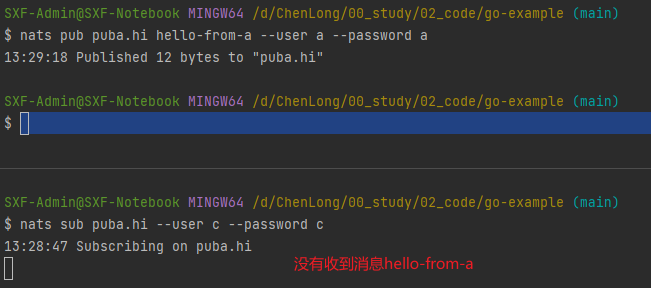
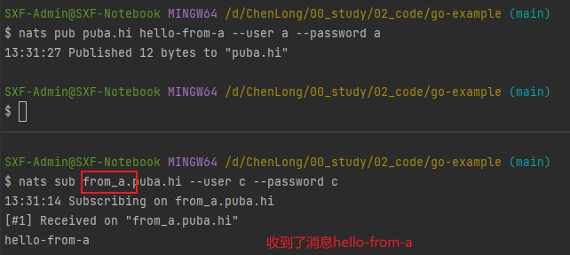
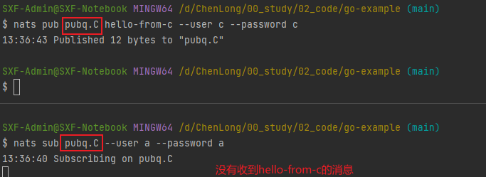
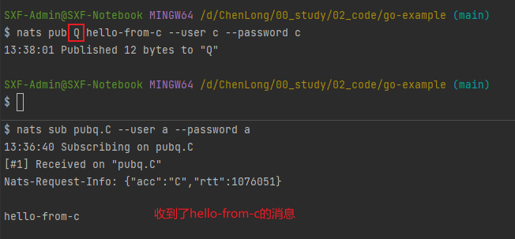

# 多租户（租户隔离）

```
# 官方文档地址
https://docs.nats.io/running-a-nats-service/configuration/securing_nats/accounts
```


## 多租户的配置
- Streams are messages your application publishes. Importing applications won't be able to make requests from your applications but will be able to consume messages you generate.
- Stream 用来发消息的
- Services are messages your application can consume and act on, enabling other accounts to make requests that are fulfilled by your account.
- Services 用来消费消息的
```
accounts: {
    A: {
        users: [
            {user: a, password: a}
        ]
        exports: [
            {stream: puba.>}
            {service: pubq.>}
            {stream: b.>, accounts: [B]}
            {service: q.b, accounts: [B]}
        ]
    },
    B: {
        users: [
            {user: b, password: b}
        ]
        imports: [
            {stream: {account: A, subject: b.>}}
            {service: {account: A, subject: q.b}}
        ]
    }
    C: {
        users: [
            {user: c, password: c}
        ]
        imports: [
            {stream: {account: A, subject: puba.>}, prefix: from_a}
            {service: {account: A, subject: pubq.C}, to: Q}
        ]
    }
}
no_auth_user: a
```
he above example shows how clients without authentication can be associated with the user a within account A.

## 验证测试
### 验证stream: 租户A和租户B都有订阅b.>，因此它们两都能收到a用户发布的消息，但A租户不能收到b用户发布的消息(是可以往主题中发布消息，但不能订阅消息)
用户a发，a和b都能收到

用户b发，a收不到，b能收到


### 验证service：租户A和租户B都有订阅q.b，但b用户不能收到
用户b发，a和b都能收到；用户a发，a收到，b能收不到


### 验证C租户：带前缀from_a



### 验证C租户：to重命名主题

