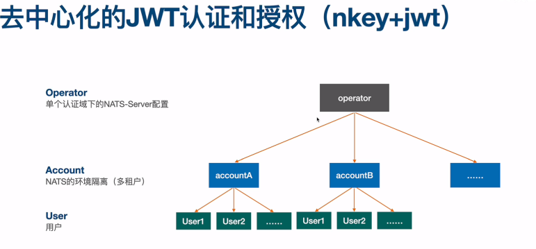
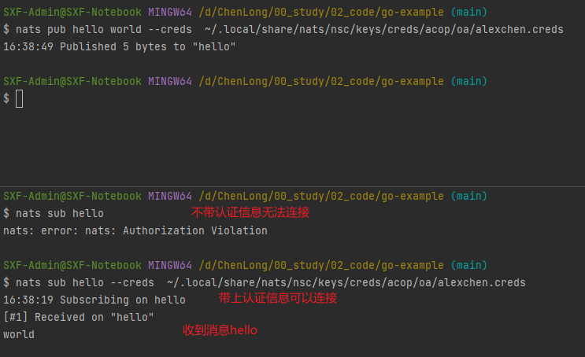
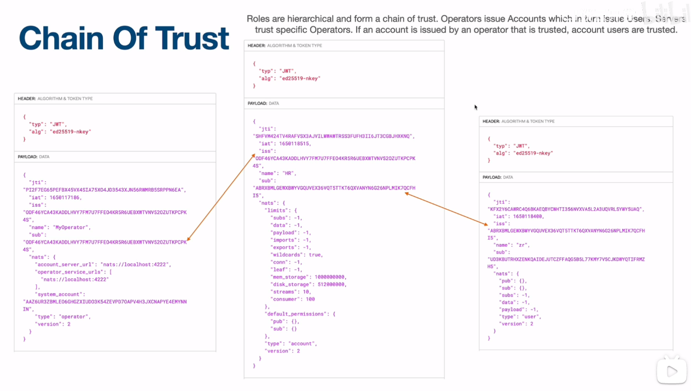
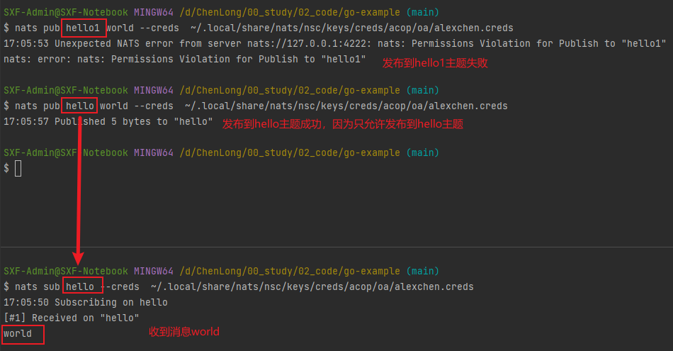
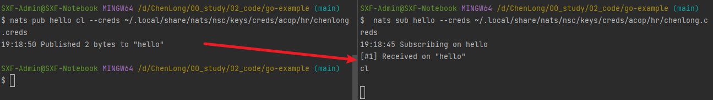

# 去中心化的JWT认证和授权（nkey+jwt）



## NSC：已创建NATS账号和用户访问配置的工具
```
# 官方文档
https://docs.nats.io/using-nats/nats-tools/nsc

https://github.com/nats-io/nsc

# 安装下载地址
https://github.com/nats-io/nsc/releases
```

```
curl -L https://raw.githubusercontent.com/nats-io/nsc/main/install.py | python
```

```
brew tap nats-io/nats-tools
brew install nats-io/nats-tools/nsc 
```

## 创建

### 创建operator（名字：acop, 默认租户sys）
```
$ nsc add operator acop --sys
[ OK ] generated and stored operator key "ODHOM3CIDXQKRTHT6MWRS5RKVJ5GFYCL7DNAZDE42STFFCVIOTP6S5JT"
[ OK ] added operator "acop"
[ OK ] When running your own nats-server, make sure they run at least version 2.2.0
[ OK ] created system_account: name:SYS id:ABDACZI2WSHTON2SAEBDHQ5D2DPK4SOH23VSSG4CFUD2QVFNO2KE53FP
[ OK ] created system account user: name:sys id:UCL2KCRMTFM2MUJABIUKLDPZITBA7JIHP5QOBRH2U625I2B7YKEBF33F        
[ OK ] system account user creds file stored in `~\.local\share\nats\nsc\keys\creds\acop\SYS\sys.creds`
```

```
SXF-Admin@SXF-Notebook MINGW64 ~/.local/share/nats/nsc
$ tree .
.
|-- keys
|   |-- creds
|   |   `-- acop
|   |       `-- SYS
|   |           `-- sys.creds
|   `-- keys
|       |-- A
|       |   |-- B4
|       |   |   `-- AB4PJGYKVVDQ7Z4DPDWLDBCVS52EJ6XEUE7XLFJ22NF3WEULJIM6PLT5.nk
|       |   `-- BD
|       |       `-- ABDACZI2WSHTON2SAEBDHQ5D2DPK4SOH23VSSG4CFUD2QVFNO2KE53FP.nk
|       |-- O
|       |   `-- DH
|       |       `-- ODHOM3CIDXQKRTHT6MWRS5RKVJ5GFYCL7DNAZDE42STFFCVIOTP6S5JT.nk
|       `-- U
|           `-- CL
|               `-- UCL2KCRMTFM2MUJABIUKLDPZITBA7JIHP5QOBRH2U625I2B7YKEBF33F.nk
`-- stores
    `-- acop
        |-- accounts
        |   `-- SYS
        |       |-- SYS.jwt
        |       `-- users
        |           `-- sys.jwt
        `-- acop.jwt

17 directories, 8 files
```

### 创建account
``` 
$ nsc add account oa
[ OK ] generated and stored account key "AD3R5Z4FE5BELKUEIX3J7DCDS37O2SQD7CVJAEKFGAWF3T6URLE3SW57"
[ OK ] added account "oa"
```

``` 
SXF-Admin@SXF-Notebook MINGW64 ~/.local/share/nats/nsc
$ tree .
.
|-- keys
|   |-- creds
|   |   `-- acop
|   |       `-- SYS
|   |           `-- sys.creds
|   `-- keys
|       |-- A
|       |   |-- B4
|       |   |   `-- AB4PJGYKVVDQ7Z4DPDWLDBCVS52EJ6XEUE7XLFJ22NF3WEULJIM6PLT5.nk
|       |   |-- BD
|       |   |   `-- ABDACZI2WSHTON2SAEBDHQ5D2DPK4SOH23VSSG4CFUD2QVFNO2KE53FP.nk
|       |   `-- D3
|       |       `-- AD3R5Z4FE5BELKUEIX3J7DCDS37O2SQD7CVJAEKFGAWF3T6URLE3SW57.nk
|       |-- O
|       |   `-- DH
|       |       `-- ODHOM3CIDXQKRTHT6MWRS5RKVJ5GFYCL7DNAZDE42STFFCVIOTP6S5JT.nk
|       `-- U
|           `-- CL
|               `-- UCL2KCRMTFM2MUJABIUKLDPZITBA7JIHP5QOBRH2U625I2B7YKEBF33F.nk
`-- stores
    `-- acop
        |-- accounts
        |   |-- SYS
        |   |   |-- SYS.jwt
        |   |   `-- users
        |   |       `-- sys.jwt
        |   `-- oa
        |       `-- oa.jwt
        `-- acop.jwt

19 directories, 10 files

```

### 创建user
``` 
$ nsc add user alexchen
[ OK ] generated and stored user key "UC4D3S3TEF5HLYTBJXE25537LEMRHGJXHO4RNG5GI2MH6UMRGJ6DJ6WX"
[ OK ] generated user creds file `~\.local\share\nats\nsc\keys\creds\acop\oa\alexchen.creds`
[ OK ] added user "alexchen" to account "oa"
```

``` 
SXF-Admin@SXF-Notebook MINGW64 ~/.local/share/nats/nsc
$ tree .
.
|-- keys
|   |-- creds
|   |   `-- acop
|   |       |-- SYS
|   |       |   `-- sys.creds
|   |       `-- oa
|   |           `-- alexchen.creds
|   `-- keys
|       |-- A
|       |   |-- B4
|       |   |   `-- AB4PJGYKVVDQ7Z4DPDWLDBCVS52EJ6XEUE7XLFJ22NF3WEULJIM6PLT5.nk
|       |   |-- BD
|       |   |   `-- ABDACZI2WSHTON2SAEBDHQ5D2DPK4SOH23VSSG4CFUD2QVFNO2KE53FP.nk
|       |   `-- D3
|       |       `-- AD3R5Z4FE5BELKUEIX3J7DCDS37O2SQD7CVJAEKFGAWF3T6URLE3SW57.nk
|       |-- O
|       |   `-- DH
|       |       `-- ODHOM3CIDXQKRTHT6MWRS5RKVJ5GFYCL7DNAZDE42STFFCVIOTP6S5JT.nk
|       `-- U
|           |-- C4
|           |   `-- UC4D3S3TEF5HLYTBJXE25537LEMRHGJXHO4RNG5GI2MH6UMRGJ6DJ6WX.nk
|           `-- CL
|               `-- UCL2KCRMTFM2MUJABIUKLDPZITBA7JIHP5QOBRH2U625I2B7YKEBF33F.nk
`-- stores
    `-- acop
        |-- accounts
        |   |-- SYS
        |   |   |-- SYS.jwt
        |   |   `-- users
        |   |       `-- sys.jwt
        |   `-- oa
        |       |-- oa.jwt
        |       `-- users
        |           `-- alexchen.jwt
        `-- acop.jwt

22 directories, 13 files
```

### 生成nats-server.conf配置文件
```
$ nsc generate config --nats-resolver > nats-server.conf
```

```  
$ nsc generate config --nats-resolver
# Operator named acop
operator: eyJ0eXAiOiJKV1QiLCJhbGciOiJlZDI1NTE5LW5rZXkifQ.eyJqdGkiOiJSQVhGTlFHWUVZTU1KUUM2SlJaR1c2WEhSN0gyVUJJV0R
IWFZQWFNWQU5QVzQyVVZRS0ZRIiwiaWF0IjoxNjY1MTI5Njg2LCJpc3MiOiJPREhPTTNDSURYUUtSVEhUNk1XUlM1UktWSjVHRllDTDdETkFaREU
0MlNURkZDVklPVFA2UzVKVCIsIm5hbWUiOiJhY29wIiwic3ViIjoiT0RIT00zQ0lEWFFLUlRIVDZNV1JTNVJLVko1R0ZZQ0w3RE5BWkRFNDJTVEZ
GQ1ZJT1RQNlM1SlQiLCJuYXRzIjp7InN5c3RlbV9hY2NvdW50IjoiQUJEQUNaSTJXU0hUT04yU0FFQkRIUTVEMkRQSzRTT0gyM1ZTU0c0Q0ZVRDJ
RVkZOTzJLRTUzRlAiLCJ0eXBlIjoib3BlcmF0b3IiLCJ2ZXJzaW9uIjoyfX0.W0zYHEgYfM44RgCXAWEnntQryABrUVhwPAwloINQCjtR22cgdWy
Vh_d21bnlQT5GpnctNCwnDP-KZ1UU6FPBBQ
# System Account named SYS
system_account: ABDACZI2WSHTON2SAEBDHQ5D2DPK4SOH23VSSG4CFUD2QVFNO2KE53FP

# configuration of the nats based resolver
resolver {
    type: full
    # Directory in which the account jwt will be stored
    dir: './jwt'
    # In order to support jwt deletion, set to true
    # If the resolver type is full delete will rename the jwt.
    # This is to allow manual restoration in case of inadvertent deletion.
    # To restore a jwt, remove the added suffix .delete and restart or send a reload signal.
    # To free up storage you must manually delete files with the suffix .delete.
    allow_delete: false
    # Interval at which a nats-server with a nats based account resolver will compare
    # it's state with one random nats based account resolver in the cluster and if needed,
    # exchange jwt and converge on the same set of jwt.
    interval: "2m"
    # Timeout for lookup requests in case an account does not exist locally.
    timeout: "1.9s"
}


# Preload the nats based resolver with the system account jwt.
jY291bnQtbW9uaXRvcmluZy1zdHJlYW1zIiwic3ViamVjdCI6IiRTWVMuQUNDT1VOVC4qLlx1MDAzZSIsInR5cGUiOiJzdHJlYW0iLCJhY2NvdW50X3Rva2VuX3Bvc2l0aW9uIjozLCJkZXNjcmlwdGlvbiI6IkFjY291bnQgc3BlY2lmaWMgbW9uaXRvcmluZyBzdHJlYW0iLCJpbmZvX3VybCI6Imh0dHBzOi8
0X3Rva2VuX3Bvc2l0aW9uIjozLCJkZXNjcmlwdGlvbiI6IkFjY291bnQgc3BlY2lmaWMgbW9uaXRvcmluZyBzdHJlYW0iLCJpbmZvX3VybCI6ImhlcnZpY2VzIiwic3ViamVjdCI6IiRTWVMuUkVRLkFDQ09VTlQuKi4qIiwidHlwZSI6InNlcnZpY2UiLCJyZXNwb25zZV90eXBlIjoiU3RyZWFtIiwiYWNjb3V
0dHBzOi8vZG9jcy5uYXRzLmlvL25hdHMtc2VydmVyL2NvbmZpZ3VyYXRpb24vc3lzX2FjY291bnRzIn0seyJuYW1lIjoiYWNjb3VudC1tb25pdG96IFNVQlNaLCBDT05OWiwgTEVBRlosIEpTWiBhbmQgSU5GTyIsImluZm9fdXJsIjoiaHR0cHM6Ly9kb2NzLm5hdHMuaW8vbmF0cy1zZXJ2ZXIvY29uZmlndXJ
yaW5nLXNlcnZpY2VzIiwic3ViamVjdCI6IiRTWVMuUkVRLkFDQ09VTlQuKi4qIiwidHlwZSI6InNlcnZpY2UiLCJyZXNwb25zZV90eXBlIjoiU3RjY291bnQtbW9uaXRvcmluZy1zdHJlYW1zIiwic3ViamVjdCI6IiRTWVMuQUNDT1VOVC4qLlx1MDAzZSIsInR5cGUiOiJzdHJlYW0iLCJhY2NvdW50X3Rva2VuX3Bvc2l0aW9uIjozLCJkZXNjcmlwdGlvbiI6IkFjY291bnQgc3BlY2lmaWMgbW9uaXRvcmluZyBzdHJlYW0iLCJpbmZvX3VybCI6Imh0dHBzOi8
vZG9jcy5uYXRzLmlvL25hdHMtc2VydmVyL2NvbmZpZ3VyYXRpb24vc3lzX2FjY291bnRzIn0seyJuYW1lIjoiYWNjb3VudC1tb25pdG9yaW5nLXNlcnZpY2VzIiwic3ViamVjdCI6IiRTWVMuUkVRLkFDQ09VTlQuKi4qIiwidHlwZSI6InNlcnZpY2UiLCJyZXNwb25zZV90eXBlIjoiU3RyZWFtIiwiYWNjb3V
udF90b2tlbl9wb3NpdGlvbiI6NCwiZGVzY3JpcHRpb24iOiJSZXF1ZXN0IGFjY291bnQgc3BlY2lmaWMgbW9uaXRvcmluZyBzZXJ2aWNlcyBmb3I6IFNVQlNaLCBDT05OWiwgTEVBRlosIEpTWiBhbmQgSU5GTyIsImluZm9fdXJsIjoiaHR0cHM6Ly9kb2NzLm5hdHMuaW8vbmF0cy1zZXJ2ZXIvY29uZmlndXJ
hdGlvbi9zeXNfYWNjb3VudHMifV0sImxpbWl0cyI6eyJzdWJzIjotMSwiZGF0YSI6LTEsInBheWxvYWQiOi0xLCJpbXBvcnRzIjotMSwiZXhwb3J0cyI6LTEsIndpbGRjYXJkcyI6dHJ1ZSwiY29ubiI6LTEsImxlYWYiOi0xfSwic2lnbmluZ19rZXlzIjpbIkFCNFBKR1lLVlZEUTdaNERQRFdMREJDVlM1MkV
KNlhFVUU3WExGSjIyTkYzV0VVTEpJTTZQTFQ1Il0sImRlZmF1bHRfcGVybWlzc2lvbnMiOnsicHViIjp7fSwic3ViIjp7fX0sInR5cGUiOiJhY2NvdW50IiwidmVyc2lvbiI6Mn19.5otOD-6Od_oQ-nPajug5_pWZADpBq9VJyf4G7tFqCXofVS7MgaqZrH8BubyJM7wrWc_ei1_LwhmOiiXMwj_RBA,       
}
```

在配置文件中添加
```
jetstream: enabled
http_port: 8222
```

## operator操作
### 查看operator那些参数可以配置
``` 
$ nsc describe operator                               
+---------------------------------------------------------------------------------------+
|                                   Operator Details                                    |
+----------------------+----------------------------------------------------------------+
| Name                 | acop                                                           |
| Operator ID          | ODHOM3CIDXQKRTHT6MWRS5RKVJ5GFYCL7DNAZDE42STFFCVIOTP6S5JT       |
| Issuer ID            | ODHOM3CIDXQKRTHT6MWRS5RKVJ5GFYCL7DNAZDE42STFFCVIOTP6S5JT       |
| Issued               | 2022-10-07 08:01:26 UTC                                        |
| Expires              |                                                                |
| System Account       | ABDACZI2WSHTON2SAEBDHQ5D2DPK4SOH23VSSG4CFUD2QVFNO2KE53FP / SYS |
| Require Signing Keys | false                                                          |
+----------------------+----------------------------------------------------------------+
```

### 查看operator那些参数可以编辑
``` 
$ nsc edit operator                                   
Error: specify an edit option
Usage:
  nsc edit operator [flags]

Flags:
  -u, --account-jwt-server-url string   set account jwt server url for nsc sync (only http/https/nats urls suppo
rted if updating with nsc)
      --expiry string                   valid until ('0' is always, '2M' is two months) - yyyy-mm-dd, #m(inutes)
, #h(ours), #d(ays), #w(eeks), #M(onths), #y(ears) (default "0")
  -h, --help                            help for operator
      --require-signing-keys            require accounts/user to be signed with a signing key
      --rm-account-jwt-server-url       clear account server url
      --rm-service-url strings          remove an operator service url for nsc where clients can access the NATS
 service (only nats/tls urls supported)
      --rm-sk strings                   remove signing key - comma separated list or option can be specified mul
tiple times
      --rm-tag strings                  remove tag - comma separated list or option can be specified multiple ti
mes
  -n, --service-url strings             add an operator service url for nsc where clients can access the NATS se
rvice (only nats/tls urls supported)
      --sk strings                      signing key or keypath or the value "generate"" to generate a key pair o
n the fly - comma separated list or option can be specified multiple times
      --start string                    valid from ('0' is always, '3d' is three days) - yyyy-mm-dd, #m(inutes),
 #h(ours), #d(ays), #w(eeks), #M(onths), #y(ears) (default "0")
      --system-account string           set system account by account by public key or name
      --tag strings                     add tags for user - comma separated list or option can be specified mult
iple times

Global Flags:
      --config-dir string     nsc config directory
      --data-dir string       nsc data store directory
  -i, --interactive           ask questions for various settings
      --keystore-dir string   nsc keystore directory
  -K, --private-key string    Key used to sign. Can be specified as role (where applicable),
                              public key (private portion is retrieved)
                              or file path to a private key or private key

```

### 添加nats-server服务地址(Operator Service URLs)
```  
$ nsc edit operator --service-url nats://localhost:4222
[ OK ] added service url "nats://localhost:4222"
[ OK ] edited operator "acop"
```

```
$ nsc describe operator
+----------------------------------------------------------------------------------------+
|                                    Operator Details                                    |
+-----------------------+----------------------------------------------------------------+
| Name                  | acop                                                           |
| Operator ID           | ODHOM3CIDXQKRTHT6MWRS5RKVJ5GFYCL7DNAZDE42STFFCVIOTP6S5JT       |
| Issuer ID             | ODHOM3CIDXQKRTHT6MWRS5RKVJ5GFYCL7DNAZDE42STFFCVIOTP6S5JT       |
| Issued                | 2022-10-07 08:22:31 UTC                                        |
| Expires               |                                                                |
| Operator Service URLs | nats://localhost:4222                                          |
| System Account        | ABDACZI2WSHTON2SAEBDHQ5D2DPK4SOH23VSSG4CFUD2QVFNO2KE53FP / SYS |
| Require Signing Keys  | false                                                          |
+-----------------------+----------------------------------------------------------------+
```

### 添加账户jwt服务地址(Account JWT Server)
``` 
$ nsc edit operator --account-jwt-server-url nats://localhost:4222
[ OK ] set account jwt server url to "nats://localhost:4222"
[ OK ] edited operator "acop"
```

```  
$ nsc describe operator
+----------------------------------------------------------------------------------------+
|                                    Operator Details                                    |
+-----------------------+----------------------------------------------------------------+
| Name                  | acop                                                           |
| Operator ID           | ODHOM3CIDXQKRTHT6MWRS5RKVJ5GFYCL7DNAZDE42STFFCVIOTP6S5JT       |
| Issuer ID             | ODHOM3CIDXQKRTHT6MWRS5RKVJ5GFYCL7DNAZDE42STFFCVIOTP6S5JT       |
| Issued                | 2022-10-07 08:25:16 UTC                                        |
| Expires               |                                                                |
| Account JWT Server    | nats://localhost:4222                                          |
| Operator Service URLs | nats://localhost:4222                                          |
| System Account        | ABDACZI2WSHTON2SAEBDHQ5D2DPK4SOH23VSSG4CFUD2QVFNO2KE53FP / SYS |
| Require Signing Keys  | false                                                          |
+-----------------------+----------------------------------------------------------------+
```

### 将本地的配置文件推送至operator
```   
$ nsc push -A
[ OK ] push to nats-server "nats://localhost:4222" using system account "SYS":
       [ OK ] push SYS to nats-server with nats account resolver:
              [ OK ] pushed "SYS" to nats-server NADPGRNDVCTRXF26NNVYC7CTCRF6U46MPXSVJU4LMUPKFBMOEZ7TIJUN: jwt updated
              [ OK ] pushed to a total of 1 nats-server
       [ OK ] push oa to nats-server with nats account resolver:
              [ OK ] pushed "oa" to nats-server NADPGRNDVCTRXF26NNVYC7CTCRF6U46MPXSVJU4LMUPKFBMOEZ7TIJUN: jwt updated
              [ OK ] pushed to a total of 1 nats-server
```
注：-A推送本地所有配置

或者
``` 
$ nsc push -A -u nats://localhost:4222
[ OK ] push to nats-server "nats://localhost:4222" using system account "SYS":
       [ OK ] push SYS to nats-server with nats account resolver:
              [ OK ] pushed "SYS" to nats-server NADPGRNDVCTRXF26NNVYC7CTCRF6U46MPXSVJU4LMUPKFBMOEZ7TIJUN: jwt updated
              [ OK ] pushed to a total of 1 nats-server
       [ OK ] push oa to nats-server with nats account resolver:
              [ OK ] pushed "oa" to nats-server NADPGRNDVCTRXF26NNVYC7CTCRF6U46MPXSVJU4LMUPKFBMOEZ7TIJUN: jwt updated
              [ OK ] pushed to a total of 1 nats-server
```
注：-u为需要推送到的服务地址

### 查看nsc环境变量（查看配置信息保存地址 $NKEYS_PATH）
```   
$ nsc env
+----------------------------------------------------------------------------------------------------------+
|                                             NSC Environment                                              |
+--------------------+-----+-------------------------------------------------------------------------------+
| Setting            | Set | Effective Value                                                               |
+--------------------+-----+-------------------------------------------------------------------------------+
| $NSC_CWD_ONLY      | No  | If set, default operator/account from cwd only                                |
| $NSC_NO_GIT_IGNORE | No  | If set, no .gitignore files written                                           |
| $NKEYS_PATH        | No  | ~\.local\share\nats\nsc\keys                                                  |
| $NSC_HOME          | No  | ~\.config\nats\nsc                                                            |
| $NATS_CA           | No  | If set, root CAs in the referenced file will be used for nats connections     |
|                    |     | If not set, will default to the system trust store                            |
| $NATS_KEY          | No  | If set, the tls key in the referenced file will be used for nats connections  |
| $NATS_CERT         | No  | If set, the tls cert in the referenced file will be used for nats connections |
+--------------------+-----+-------------------------------------------------------------------------------+
| From CWD           |     | No                                                                            |
| Default Stores Dir |     | ~\.local\share\nats\nsc\stores                                                |
| Current Store Dir  |     | ~\.local\share\nats\nsc\stores                                                |
| Current Operator   |     | acop                                                                          |
| Current Account    |     | oa                                                                            |
| Root CAs to trust  |     | Default: System Trust Store                                                   |
+--------------------+-----+-------------------------------------------------------------------------------+
```

```
SXF-Admin@SXF-Notebook MINGW64 ~/.local/share/nats/nsc/keys
$ tree .
.
|-- creds
|   `-- acop
|       |-- SYS
|       |   `-- sys.creds
|       `-- oa
|           `-- alexchen.creds
`-- keys
    |-- A
    |   |-- B4
    |   |   `-- AB4PJGYKVVDQ7Z4DPDWLDBCVS52EJ6XEUE7XLFJ22NF3WEULJIM6PLT5.nk
    |   |-- BD
    |   |   `-- ABDACZI2WSHTON2SAEBDHQ5D2DPK4SOH23VSSG4CFUD2QVFNO2KE53FP.nk
    |   `-- D3
    |       `-- AD3R5Z4FE5BELKUEIX3J7DCDS37O2SQD7CVJAEKFGAWF3T6URLE3SW57.nk
    |-- O
    |   `-- DH
    |       `-- ODHOM3CIDXQKRTHT6MWRS5RKVJ5GFYCL7DNAZDE42STFFCVIOTP6S5JT.nk
    `-- U
        |-- C4
        |   `-- UC4D3S3TEF5HLYTBJXE25537LEMRHGJXHO4RNG5GI2MH6UMRGJ6DJ6WX.nk
        `-- CL
            `-- UCL2KCRMTFM2MUJABIUKLDPZITBA7JIHP5QOBRH2U625I2B7YKEBF33F.nk

14 directories, 8 files  
```

### 查看用户连接信息
```   
SXF-Admin@SXF-Notebook MINGW64 ~/.local/share/nats/nsc/keys/creds/acop/oa
$ cat alexchen.creds 
-----BEGIN NATS USER JWT-----
eyJ0eXAiOiJKV1QiLCJhbGciOiJlZDI1NTE5LW5rZXkifQ.eyJqdGkiOiJWN0RMUlI2WURFM0RST0NZRVBCVE1VU0xJSFNPWUM1WUtDTlVKSE5SS1VHRTROWkw3NkxRIiwiaWF0IjoxN
jY1MTMwMDAwLCJpc3MiOiJBRDNSNVo0RkU1QkVMS1VFSVgzSjdEQ0RTMzdPMlNRRDdDVkpBRUtGR0FXRjNUNlVSTEUzU1c1NyIsIm5hbWUiOiJhbGV4Y2hlbiIsInN1YiI6IlVDNEQzU
zNURUY1SExZVEJKWEUyNTUzN0xFTVJIR0pYSE80Uk5HNUdJMk1INlVNUkdKNkRKNldYIiwibmF0cyI6eyJwdWIiOnt9LCJzdWIiOnt9LCJzdWJzIjotMSwiZGF0YSI6LTEsInBheWxvY
WQiOi0xLCJ0eXBlIjoidXNlciIsInZlcnNpb24iOjJ9fQ.go7UqZadqHR7gNxjllC5jr64wX8_VVvUH7H67bpbQTJAKlvMcxERhGWdunJR9w0SqsCuKdOl8sewBvBwSW8vCA        
------END NATS USER JWT------

************************* IMPORTANT *************************
NKEY Seed printed below can be used to sign and prove identity.
NKEYs are sensitive and should be treated as secrets.

-----BEGIN USER NKEY SEED-----
SUAKHYML3S5N47WW2CMBKMC6CXGXELZETKVDH3DXUO4MIJ2XNANJSELAHU
------END USER NKEY SEED------

*************************************************************
```
注：这里保存了jwt内容和nkey的私钥或seed

### 验证测试


#### tcpdump抓包验证
``` 
sudo tcpdump -i lo0 -A -s 'tcp port 4222 and (((ip[2:2] - ((ip[0]&0xf)<<2)) - ((tcp[12]&0xf0)>>2)) != 0)'
```

## 认证链（Chain Of Trust）


## user操作
### 查看用户的配置信息
``` 
$ nsc describe user --account oa
+---------------------------------------------------------------------------------+
|                                      User                                       |
+----------------------+----------------------------------------------------------+
| Name                 | alexchen                                                 |
| User ID              | UC4D3S3TEF5HLYTBJXE25537LEMRHGJXHO4RNG5GI2MH6UMRGJ6DJ6WX |
| Issuer ID            | AD3R5Z4FE5BELKUEIX3J7DCDS37O2SQD7CVJAEKFGAWF3T6URLE3SW57 |
| Issued               | 2022-10-07 08:59:16 UTC                                  |
| Expires              |                                                          |
| Bearer Token         | No                                                       |
+----------------------+----------------------------------------------------------+
| Max Msg Payload      | Unlimited                                                |
| Max Data             | Unlimited                                                |
| Max Subs             | Unlimited                                                |
| Network Src          | Any                                                      |
| Time                 | Any                                                      |
+----------------------+----------------------------------------------------------+

```

### 编辑用户允许订阅的主题
```
$ nsc edit user --account oa --name alexchen --allow-pub "hello,oa.*"
[ OK ] added pub "hello"                                                                    
[ OK ] added pub "oa.*"                                                                     
[ OK ] generated user creds file `~\.local\share\nats\nsc\keys\creds\acop\oa\alexchen.creds`
[ OK ] edited user "alexchen" 
```
``` 
$ nsc describe user --account oa
+---------------------------------------------------------------------------------+
|                                      User                                       |
+----------------------+----------------------------------------------------------+
| Name                 | alexchen                                                 |
| User ID              | UC4D3S3TEF5HLYTBJXE25537LEMRHGJXHO4RNG5GI2MH6UMRGJ6DJ6WX |
| Issuer ID            | AD3R5Z4FE5BELKUEIX3J7DCDS37O2SQD7CVJAEKFGAWF3T6URLE3SW57 |
| Issued               | 2022-10-07 08:59:16 UTC                                  |
| Expires              |                                                          |
| Bearer Token         | No                                                       |
+----------------------+----------------------------------------------------------+
| Pub Allow            | hello                                                    |
|                      | oa.*                                                     |
| Response Permissions | Not Set                                                  |
+----------------------+----------------------------------------------------------+
| Max Msg Payload      | Unlimited                                                |
| Max Data             | Unlimited                                                |
| Max Subs             | Unlimited                                                |
| Network Src          | Any                                                      |
| Time                 | Any                                                      |
+----------------------+----------------------------------------------------------+
```

### 将本地配置推送至operator
```
$ nsc push -A
[ OK ] push to nats-server "nats://localhost:4222" using system account "SYS":
       [ OK ] push SYS to nats-server with nats account resolver:
              [ OK ] pushed "SYS" to nats-server NADPGRNDVCTRXF26NNVYC7CTCRF6U46MPXSVJU4LMUPKFBMOEZ7TIJUN: jwt updated   
              [ OK ] pushed to a total of 1 nats-server
       [ OK ] push oa to nats-server with nats account resolver:
              [ OK ] pushed "oa" to nats-server NADPGRNDVCTRXF26NNVYC7CTCRF6U46MPXSVJU4LMUPKFBMOEZ7TIJUN: jwt updated    
              [ OK ] pushed to a total of 1 nats-server

```
### 验证测试

``` 
$ nats pub oa.hi world --creds  ~/.local/share/nats/nsc/keys/creds/acop/oa/alexchen.creds
17:08:32 Published 5 bytes to "oa.hi"
```

## 认证链示例

### 1 生成operator的签名Signing Keys并绑定到租户hr
#### 1.1 生成operator的nkey
```  
$ nsc generate nkey --operator --store
OCQQFDKZ3JGNYL66CVQLBYJSZ7HG5TXLTFA7HUDWIP242SXVDM2LTKR4
operator key stored C:\Users\Sangfor\.local\share\nats\nsc\keys\keys\O\CQ\OCQQFDKZ3JGNYL66CVQLBYJSZ7HG5TXLTFA7HUDWIP242SXVDM2LTKR4.nk
```

#### 1.2 将nkey绑定到operator（利用上面产生的公钥OCQQFDKZ3JGNYL66CVQLBYJSZ7HG5TXLTFA7HUDWIP242SXVDM2LTKR4）
```
$ nsc edit operator --sk OCQQFDKZ3JGNYL66CVQLBYJSZ7HG5TXLTFA7HUDWIP242SXVDM2LTKR4
[ OK ] added signing key "OCQQFDKZ3JGNYL66CVQLBYJSZ7HG5TXLTFA7HUDWIP242SXVDM2LTKR4"
[ OK ] edited operator "acop"
```
#### 1.3 查看operator详情
```
$ nsc describe operator
+----------------------------------------------------------------------------------------+
|                                    Operator Details                                    |
+-----------------------+----------------------------------------------------------------+
| Name                  | acop                                                           |
| Operator ID           | ODHOM3CIDXQKRTHT6MWRS5RKVJ5GFYCL7DNAZDE42STFFCVIOTP6S5JT       |
| Issuer ID             | ODHOM3CIDXQKRTHT6MWRS5RKVJ5GFYCL7DNAZDE42STFFCVIOTP6S5JT       |
| Issued                | 2022-10-07 09:14:45 UTC                                        |
| Expires               |                                                                |
| Account JWT Server    | nats://localhost:4222                                          |
| Operator Service URLs | nats://localhost:4222                                          |
| System Account        | ABDACZI2WSHTON2SAEBDHQ5D2DPK4SOH23VSSG4CFUD2QVFNO2KE53FP / SYS |
| Require Signing Keys  | false                                                          |
+-----------------------+----------------------------------------------------------------+
| Signing Keys          | OCQQFDKZ3JGNYL66CVQLBYJSZ7HG5TXLTFA7HUDWIP242SXVDM2LTKR4       |
+-----------------------+----------------------------------------------------------------+
```
注：Signing Keys 专门作为签名用

### 2 用operator新增加的签名Signing Keys添加一个租户hr

#### 2.1 用operator的nkey添加一个租户hr
```
$ nsc add account hr -K C:\Users\Sangfor\.local\share\nats\nsc\keys\keys\O\CQ\OCQQFDKZ3JGNYL66CVQLBYJSZ7HG5TXLTFA7HUDWIP242SXVDM2LTKR4.nk
[ OK ] generated and stored account key "AAK6OIYK22WBK4MFGZESJJS5A5EXEGUNWEVQZBMSKPTKFCLSMSXBIOXU"
[ OK ] added account "hr"
```
#### 2.2 查看租户account详情
```
$ nsc describe account
+--------------------------------------------------------------------------------------+
|                                   Account Details                                    |
+---------------------------+----------------------------------------------------------+
| Name                      | hr                                                       |
| Account ID                | AAK6OIYK22WBK4MFGZESJJS5A5EXEGUNWEVQZBMSKPTKFCLSMSXBIOXU |
| Issuer ID                 | ODHOM3CIDXQKRTHT6MWRS5RKVJ5GFYCL7DNAZDE42STFFCVIOTP6S5JT |
| Issued                    | 2022-10-07 10:14:01 UTC                                  |
| Expires                   |                                                          |
+---------------------------+----------------------------------------------------------+
| Max Connections           | Unlimited                                                |
| Max Leaf Node Connections | Unlimited                                                |
| Max Data                  | Unlimited                                                |
| Max Exports               | Unlimited                                                |
| Max Imports               | Unlimited                                                |
| Max Msg Payload           | Unlimited                                                |
| Max Subscriptions         | Unlimited                                                |
| Exports Allows Wildcards  | True                                                     |
| Disallow Bearer Token     | False                                                    |
| Response Permissions      | Not Set                                                  |
+---------------------------+----------------------------------------------------------+
| Jetstream                 | Disabled                                                 |
+---------------------------+----------------------------------------------------------+
| Imports                   | None                                                     |
| Exports                   | None                                                     |
+---------------------------+----------------------------------------------------------+
```
#### 2.3 生成租户的私有的nkey并绑定到hr租户上
##### 2.3.1 生成租户account的nkey
```
$ nsc generate nkey --account --store
ACW4FQNF7CWVBY2OHBETCJSQANHD3P52GT7U4O5UQGA6AZPINFJGEIZ6
account key stored C:\Users\Sangfor\.local\share\nats\nsc\keys\keys\A\CW\ACW4FQNF7CWVBY2OHBETCJSQANHD3P52GT7U4O5UQGA6AZPINFJGEIZ6.nk
```
###### 2.3.2 将nkey绑定到account（利用上面产生的公钥ACW4FQNF7CWVBY2OHBETCJSQANHD3P52GT7U4O5UQGA6AZPINFJGEIZ6）
```
$ nsc edit account --sk ACW4FQNF7CWVBY2OHBETCJSQANHD3P52GT7U4O5UQGA6AZPINFJGEIZ6
[ OK ] added signing key "ACW4FQNF7CWVBY2OHBETCJSQANHD3P52GT7U4O5UQGA6AZPINFJGEIZ6"
[ OK ] edited account "hr"
```

###### 2.3.3 查看租户account详情
```
$ nsc describe account
+--------------------------------------------------------------------------------------+
|                                   Account Details                                    |
+---------------------------+----------------------------------------------------------+
| Name                      | hr                                                       |
| Account ID                | AAK6OIYK22WBK4MFGZESJJS5A5EXEGUNWEVQZBMSKPTKFCLSMSXBIOXU |
| Issuer ID                 | ODHOM3CIDXQKRTHT6MWRS5RKVJ5GFYCL7DNAZDE42STFFCVIOTP6S5JT |
| Issued                    | 2022-10-07 10:20:45 UTC                                  |
| Expires                   |                                                          |
+---------------------------+----------------------------------------------------------+
| Signing Keys              | ACW4FQNF7CWVBY2OHBETCJSQANHD3P52GT7U4O5UQGA6AZPINFJGEIZ6 |
+---------------------------+----------------------------------------------------------+
| Max Connections           | Unlimited                                                |
| Max Leaf Node Connections | Unlimited                                                |
| Max Data                  | Unlimited                                                |
| Max Exports               | Unlimited                                                |
| Max Imports               | Unlimited                                                |
| Max Msg Payload           | Unlimited                                                |
| Max Subscriptions         | Unlimited                                                |
| Exports Allows Wildcards  | True                                                     |
| Disallow Bearer Token     | False                                                    |
| Response Permissions      | Not Set                                                  |
+---------------------------+----------------------------------------------------------+
| Jetstream                 | Disabled                                                 |
+---------------------------+----------------------------------------------------------+
| Imports                   | None                                                     |
| Exports                   | None                                                     |
+---------------------------+----------------------------------------------------------+
```
### 3 用account新增加的签名Signing Keys添加一个用户chenlong
#### 3.1 用account的nkey添加一个用户chenlong
```
$ nsc add user chenlong -K C:\Users\Sangfor\.local\share\nats\nsc\keys\keys\A\CW\ACW4FQNF7CWVBY2OHBETCJSQANHD3P52GT7U4O5UQGA6AZPINFJGEIZ6.nk
[ OK ] generated and stored user key "UC6O24HZZFVDM3E2JXD5RVBN4R764P2VP5CNO74QF27UZ3ELA5YOLWMJ"
[ OK ] generated user creds file `~\.local\share\nats\nsc\keys\creds\acop\hr\chenlong.creds`
[ OK ] added user "chenlong" to account "hr"
```
### 4 重新生成服务端nats-server.conf配置(只要修改了operator相关配置都需要重新生成服务端配置)
```
$ nsc generate config --nats-resolver > nats-server.conf
```

### 5 推送本地配置至operator
```
$ nsc push -A
[ OK ] push to nats-server "nats://localhost:4222" using system account "SYS":
       [ OK ] push SYS to nats-server with nats account resolver:
              [ OK ] pushed "SYS" to nats-server NACVYHVHPQL3TMNWNVF3IO4AC32SVLIMLYW2MODTXAFUFOO7KGP7HOON: jwt updated
              [ OK ] pushed to a total of 1 nats-server
       [ OK ] push hr to nats-server with nats account resolver:
              [ OK ] pushed "hr" to nats-server NACVYHVHPQL3TMNWNVF3IO4AC32SVLIMLYW2MODTXAFUFOO7KGP7HOON: jwt updated
              [ OK ] pushed to a total of 1 nats-server
       [ OK ] push oa to nats-server with nats account resolver:
              [ OK ] pushed "oa" to nats-server NACVYHVHPQL3TMNWNVF3IO4AC32SVLIMLYW2MODTXAFUFOO7KGP7HOON: jwt updated
              [ OK ] pushed to a total of 1 nats-server
```
### 6 用户chenlong的nkey连接测试


## 假设场景：租户account的Signing Keys被黑客盗取
### 查看account的详细信息
```
$ nsc describe account
+--------------------------------------------------------------------------------------+
|                                   Account Details                                    |
+---------------------------+----------------------------------------------------------+
| Name                      | hr                                                       |
| Account ID                | AAK6OIYK22WBK4MFGZESJJS5A5EXEGUNWEVQZBMSKPTKFCLSMSXBIOXU |
| Issuer ID                 | ODHOM3CIDXQKRTHT6MWRS5RKVJ5GFYCL7DNAZDE42STFFCVIOTP6S5JT |
| Issued                    | 2022-10-07 10:20:45 UTC                                  |
| Expires                   |                                                          |
+---------------------------+----------------------------------------------------------+
| Signing Keys              | ACW4FQNF7CWVBY2OHBETCJSQANHD3P52GT7U4O5UQGA6AZPINFJGEIZ6 |
+---------------------------+----------------------------------------------------------+
| Max Connections           | Unlimited                                                |
| Max Leaf Node Connections | Unlimited                                                |
| Max Data                  | Unlimited                                                |
| Max Exports               | Unlimited                                                |
| Max Imports               | Unlimited                                                |
| Max Msg Payload           | Unlimited                                                |
| Max Subscriptions         | Unlimited                                                |
| Exports Allows Wildcards  | True                                                     |
| Disallow Bearer Token     | False                                                    |
| Response Permissions      | Not Set                                                  |
+---------------------------+----------------------------------------------------------+
| Jetstream                 | Disabled                                                 |
+---------------------------+----------------------------------------------------------+
| Imports                   | None                                                     |
| Exports                   | None                                                     |
+---------------------------+----------------------------------------------------------+
```
### 删除account的Signing Keys
```
nsc edit account --rm-sk ACW4FQNF7CWVBY2OHBETCJSQANHD3P52GT7U4O5UQGA6AZPINFJGEIZ6
```
```
$ nsc describe account
+--------------------------------------------------------------------------------------+
|                                   Account Details                                    |
+---------------------------+----------------------------------------------------------+
| Name                      | hr                                                       |
| Account ID                | AAK6OIYK22WBK4MFGZESJJS5A5EXEGUNWEVQZBMSKPTKFCLSMSXBIOXU |
| Issuer ID                 | ODHOM3CIDXQKRTHT6MWRS5RKVJ5GFYCL7DNAZDE42STFFCVIOTP6S5JT |
| Issued                    | 2022-10-07 10:20:45 UTC                                  |
| Expires                   |                                                          |
+---------------------------+----------------------------------------------------------+
| Max Connections           | Unlimited                                                |
| Max Leaf Node Connections | Unlimited                                                |
| Max Data                  | Unlimited                                                |
| Max Exports               | Unlimited                                                |
| Max Imports               | Unlimited                                                |
| Max Msg Payload           | Unlimited                                                |
| Max Subscriptions         | Unlimited                                                |
| Exports Allows Wildcards  | True                                                     |
| Disallow Bearer Token     | False                                                    |
| Response Permissions      | Not Set                                                  |
+---------------------------+----------------------------------------------------------+
| Jetstream                 | Disabled                                                 |
+---------------------------+----------------------------------------------------------+
| Imports                   | None                                                     |
| Exports                   | None                                                     |
+---------------------------+----------------------------------------------------------+
```
### 推送本地配置至operator
```
nsc push -A 
```
### 验证测试(结果连接失败)
```
nats sub hello --creds ~/.local/share/nats/nsc/keys/creds/acop/hr/chenlong.creds
```

## 假设场景：用户user的私钥被黑客盗取，回收用户权限（nkey）
### 删除用户chenlong的nkey
```   
nsc revocations add-user --account hr --name chenlong
```
### 推送本地配置至operator
```
nsc push -A 
```
### 验证测试(结果连接失败)
```
nats sub hello --creds ~/.local/share/nats/nsc/keys/creds/acop/hr/chenlong.creds
```