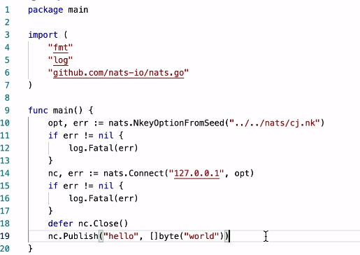

# NKeys

## 概览
**NKeys 是一种基于 Ed25519 的新型、高度安全的公钥签名系统**

使用NKeys，服务器可以验证身份，而无需存储或查看私钥。身份验证系统的工作原理是要求连接的客户端提供其公钥并使用其私钥对随机挑战码（challenge）进行数字签名。服务器为每个连接请求生成一个随机挑战码，使其免受攻击。生成的签名根据提供的公钥进行验证，从而证明客户的身份。如果服务器有公钥，则认证成功。

处理32字节和64字节的原始秘钥比较麻烦，NKEYS以更友好的方式制定秘钥，并参考在加密货币中完成的工作，特别是Stellar。NKEYS使用类似的格式，其中公钥和私钥的前缀为1字节，种子的前缀为2字节。这些前缀的base32编码将产生友好的人类可读性前缀，例如 N=服务器， C=集群， O=操作员， A=账户， U=用户。 P用于私钥。对于种子，第一个编码前缀是S，第二字符是公钥类型，例如 SU 是用户秘钥对的种子， SA 是账户秘钥对的种子。

## 安装SKeys
```azure
go install github.com/nats-io/nkeys/nk@latest
```

## 使用
### 生成nkey秘钥对，一起输出公钥
```azure
# 用户类型
$nk -gen user -pubout > ac.nk
$ cat ac.nk 
SUAN3KP2WDYAKFWBUH2ZEWGWDMNVMRBZQ6KQTHU6YPQ62WUTG7HOLE6X4Q
UDGHDNV6ADVR5CP2JYNLRAG6LZJNWJYS66JLO3NE327BXMDJTF5LFIE4
```

### nats-server.conf配置文件
```azure
jetstream: enabled
http_port: 8222

authorization {
    users = [
    {nkey: UDGHDNV6ADVR5CP2JYNLRAG6LZJNWJYS66JLO3NE327BXMDJTF5LFIE4}]
}
```

## 验证测试

#### 认证失败
```azure
$ nats account info
nats.exe: error: setup failed: nats: Authorization Violation
```
#### 认证成功
```azure
$ nats account info --nkey ./ac.nk
Connection Information:

    Client ID: 5
               Client IP: 172.26.0.1
RTT: 1.2266ms
       Headers Supported: true
         Maximum Payload: 1.0 MiB
           Connected URL: nats://127.0.0.1:4222
       Connected Address: 127.0.0.1:4222
     Connected Server ID: NAXAA7S35WC2GW7L57NRMF5VFSISAX4TBFAW56EHSUOCEVJOO2P5LSGJ
          TLS Connection: no

JetStream Account Information:

Account Usage:

    Storage: 0 B
     Memory: 0 B
    Streams: 0
  Consumers: 0

Account Limits:

    Max Message Payload: 1.0 MiB

    Tier: Default

      Configuration Requirements:

    Stream Requires Max Bytes Set: false
          Consumer Maximum Ack Pending: Unlimited

      Stream Resource Usage Limits:

                    Memory: 0 B of Unlimited
         Memory Per Stream: Unlimited
                   Storage: 0 B of Unlimited
        Storage Per Stream: Unlimited
                   Streams: 0 of Unlimited
                 Consumers: 0 of Unlimited
```

## go代码
