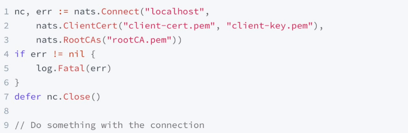

# TLS认证

X509证书的使用场景很对，之前我们用到的tls的客户端加密连接，也可以用来做客户端身份的认证，那么通过什么来标识证书的用途呢？在x509的标准规范力，有**key usage and extended key usage**这两个竖向，可以用来定义key的用途。

在NATS里，通过通过秘钥（extended key usage）来标识证书的用途：
- TLS WWW server authentication：作为连接服务器的身份验证，NATS服务器端证书需要包含此内容的证书。
- TLS WWW client authentication：作为NTAS客户端证书用于身份验证，仅在连接到指定了verify、verify_and_map或verify_cert_and_check_known_urls的服务器时才需要。在这些情况下，NATS客户端将需要具有此值的证书。

使用mkcert自签证书，需要增加-client参数，如：
```azure
$ mkcert -client -cert-file ../certs/client-cert.pem -key-file ../certs/client-key.pem localhost ::1 127.0.0.1 192.168.0.110

Created a new certificate valid for the following names 📜
 - "localhost"
 - "::1"
 - "127.0.0.1"
 - "192.168.0.110"

The certificate is at "../certs/client-cert.pem" and the key at "../certs/client-key.pem" ✅

It will expire on 6 January 2025 🗓
```

## docker-compose执行
```azure
docker-compose up -d
```

## 不带证书执行
```azure
$ nats stream info 
nats.exe: error: setup failed: remote error: tls: bad certificate
```

## 带证书执行
```azure
$ nats stream info --tlscert ../certs/client-cert.pem --tlskey ../certs/client-key.pem
nats.exe: error: could not pick a Stream to operate on: no Streams are defined
```

```azure
$ nats account info --tlscert ../certs/client-cert.pem --tlskey ../certs/client-key.pem
Connection Information:

               Client ID: 10
               Client IP: 172.19.0.1
                     RTT: 2.0061ms
       Headers Supported: true
         Maximum Payload: 1.0 MiB
           Connected URL: nats://127.0.0.1:4222
       Connected Address: 127.0.0.1:4222
     Connected Server ID: ND3UDMOX7H5BUONUYSBBAX3DCRWKJKHNUMUATM5KAEO2FVHVI5YMWJX5
             TLS Version: 1.3 using TLS_AES_128_GCM_SHA256
              TLS Server:
            TLS Verified: issuer CN=mkcert SXF-NOTEBOOK\\SXF-Admin@SXF-Notebook,OU=SXF-NOTEBOOK\\SXF-Admin@SXF-N
otebook,O=mkcert development CA

JetStream Account Information:

Account Usage:

    Storage: 0 B
     Memory: 0 B
    Streams: 0
  Consumers: 0

Account Limits:

   Max Message Payload: 1.0 MiB

   Tier: Default

      Configuration Requirements:

         Stream Requires Max Bytes Set: false
          Consumer Maximum Ack Pending: Unlimited

      Stream Resource Usage Limits:

                    Memory: 0 B of Unlimited
         Memory Per Stream: Unlimited
                   Storage: 0 B of Unlimited
        Storage Per Stream: Unlimited
                   Streams: 0 of Unlimited
                 Consumers: 0 of Unlimited
```

## 签发一个新的证书alexchen
```azure
$ mkcert --help
-cert-file FILE, -key-file FILE
```

## 带自签发证书执行
```azure
$ nats account info --tlscert alexchen-cert.pem --tlskey alexchen-key.pem 
Connection Information:

               Client ID: 11
               Client IP: 172.19.0.1
                     RTT: 1.0634ms
       Headers Supported: true
         Maximum Payload: 1.0 MiB
           Connected URL: nats://127.0.0.1:4222
       Connected Address: 127.0.0.1:4222
     Connected Server ID: ND3UDMOX7H5BUONUYSBBAX3DCRWKJKHNUMUATM5KAEO2FVHVI5YMWJX5
             TLS Version: 1.3 using TLS_AES_128_GCM_SHA256
              TLS Server:
            TLS Verified: issuer CN=mkcert SXF-NOTEBOOK\\SXF-Admin@SXF-Notebook,OU=SXF-NOTEBOOK\\SXF-Admin@SXF-N
otebook,O=mkcert development CA

JetStream Account Information:

Account Usage:

    Storage: 0 B
     Memory: 0 B
    Streams: 0
  Consumers: 0

Account Limits:

   Max Message Payload: 1.0 MiB

   Tier: Default

      Configuration Requirements:

         Stream Requires Max Bytes Set: false
          Consumer Maximum Ack Pending: Unlimited

      Stream Resource Usage Limits:

                    Memory: 0 B of Unlimited
         Memory Per Stream: Unlimited
                   Storage: 0 B of Unlimited
        Storage Per Stream: Unlimited
                   Streams: 0 of Unlimited
                 Consumers: 0 of Unlimited
```


## 用户和用户映射map(verify_and_map: true, example:user-map)
### 查看users相关信息（通过openssl工具查询）
```azure
$ openssl x509 -noout -text -in alexchen-cert.pem 
Certificate:
    Data:
        Version: 3 (0x2)
        Serial Number:
            e1:e0:34:af:55:c9:66:ee:a7:78:d9:af:a3:7d:12:a9
        Signature Algorithm: sha256WithRSAEncryption
        Issuer: O = mkcert development CA, OU = SXF-NOTEBOOK\\SXF-Admin@SXF-Notebook, CN = mkcert SXF-NOTEBOOK\\
SXF-Admin@SXF-Notebook
        Validity
            Not Before: Oct  6 11:04:33 2022 GMT
            Not After : Jan  6 11:04:33 2025 GMT
        Subject: O = mkcert development certificate, OU = SXF-NOTEBOOK\\SXF-Admin@SXF-Notebook
        Subject Public Key Info:
            Public Key Algorithm: rsaEncryption
                RSA Public-Key: (2048 bit)
                Modulus:
                    00:b6:de:5a:f9:5a:3c:7d:d3:cf:2b:f8:8b:fb:ec:
                    02:3f:14:fd:3a:3e:80:0e:b6:bb:50:6a:88:e8:02:
                    cd:ce:79:b0:60:71:3d:1c:12:96:46:5e:fa:05:4e:
                    a4:b6:43:97:aa:03:46:03:92:df:a7:a5:e9:dd:6b:
                    71:4a:2d:ef:80:c8:3a:0f:8a:9a:b9:92:06:62:6e:
                    9d:5d:42:b2:b9:56:20:46:52:9b:ed:a7:01:21:51:
                    65:03:8c:c4:1a:e7:a6:90:51:3b:47:ba:50:66:31:
                    1f:fb:42:90:57:f1:15:58:92:0f:79:cd:38:31:0d:
                    83:09:da:65:d0:18:66:9b:94:ba:cb:70:73:f6:ff:
                    7a:00:99:f0:e2:c9:57:28:6c:f3:d8:7e:9c:52:91:
                    80:2d:8a:21:95:20:d2:3c:68:02:80:7d:1c:83:f3:
                    68:6d:d8:9a:b7:ce:a8:22:50:78:49:f1:32:ef:f4:
                    3a:c9:22:d7:6c:3b:05:9b:3b:7d:22:94:73:df:0a:
                    15:6f:68:3a:29:fd:71:3e:0f:98:29:53:32:40:1a:
                    98:ac:b9:10:3f:9d:74:1b:6d:20:57:79:31:dc:ba:
                    1a:ff:db:0b:8f:07:62:36:30:90:3c:7b:cb:8a:ca:
                    1e:64:3a:d9:33:ad:04:2a:0b:3e:59:94:4e:c3:01:
                    ff:41
                Exponent: 65537 (0x10001)
        X509v3 extensions:
            X509v3 Key Usage: critical
                Digital Signature, Key Encipherment
            X509v3 Extended Key Usage:
                TLS Web Client Authentication, TLS Web Server Authentication
            X509v3 Authority Key Identifier:
                keyid:85:A2:61:F3:49:55:9D:8E:EF:41:83:C4:A3:6D:AE:81:9F:DA:DF:82

            X509v3 Subject Alternative Name:
                DNS:alexchen
    Signature Algorithm: sha256WithRSAEncryption
         6b:de:19:5c:0d:47:37:cf:c3:5b:99:02:65:0a:8a:9c:20:49:
         24:cd:0c:12:f3:6f:6d:ed:cc:0c:e6:84:b3:71:4b:3a:6d:82:
         41:50:f2:ed:a9:a7:bf:a8:e2:92:af:82:15:5f:7d:9c:9b:da:
         1b:23:46:d1:57:3e:09:9b:d0:07:da:ed:38:b3:34:01:7d:fd:
         58:24:8c:f9:63:3a:1c:22:8c:ef:20:bc:1e:68:4f:e5:17:e7:
         20:5e:9d:11:32:95:7a:df:66:29:69:14:30:81:0b:c3:38:65:
         7f:62:20:3b:8e:fe:2d:27:f3:3e:e0:d0:d2:e2:8a:30:d0:2c:
         95:5c:bd:8b:29:54:77:e2:5e:c3:3d:f7:d5:84:e1:4d:45:45:
         0a:28:e8:4b:6b:dd:76:1d:7a:ec:97:0d:4d:80:a5:43:f0:5e:
         34:8a:69:a8:49:7a:d2:e5:91:76:66:33:a5:44:d8:f8:e9:29:
         e2:54:b0:53:55:bf:48:fe:e6:1e:51:74:aa:3c:ce:8c:bd:06:
         d1:f5:79:69:0b:73:d6:e3:6b:fe:e5:c8:8d:f3:18:31:62:ea:
         2f:89:3f:cc:f5:24:a8:91:c3:2e:19:10:49:10:89:2d:1c:75:
         71:dc:e4:f6:f3:2c:f6:4a:68:f1:c2:26:1a:14:7f:c3:f5:5f:
         cc:ad:2f:c5:44:b8:04:69:e6:b4:e2:97:53:8c:b6:ce:99:05:
         9b:8d:a4:d2:ee:36:99:df:20:22:ef:16:2d:5c:91:fc:a1:f5:
         7a:5b:47:15:cc:2d:e0:34:33:1d:0b:d2:51:89:94:9b:67:5b:
         5e:31:61:e5:42:80:db:51:a4:f4:ea:10:82:a0:16:43:d1:55:
         e5:13:b1:d5:9b:bc:46:99:89:aa:d0:a0:14:de:28:3a:d2:05:
         49:58:d0:cf:33:43:37:90:93:2e:e0:8e:2c:b6:ec:a7:10:af:
         75:9d:76:21:87:88:da:fb:d5:0e:07:e7:0b:75:4f:44:65:a5:
         cf:d3:c1:84:62:17
```

### 配置authorization
设置配置文件./user-map/nats-server.conf中tls里加入verify_and_map: true

把上面查询到的Subject:内容配置到./user-map/nat-server.conf文件的authorization项
```azure
jetstream: enabled
http_port: 8222

tls {
   cert_file: "./certs/server.crt"
   key_file: "./certs/server.key"
   ca_file: "./certs/rootCA.pem"
   verify_and_map: true
}

authorization {
    users = [
    {user:"alexchen"}]
}
```

注：When present, the server will check if a Subject Alternative Name (SAN) maps to a user. It will search all email addresses first, then all DNS names. If no user could be found, it will try the certificate subject.


### 验证测试
```azure
$ cd tls-authentication
    $ nats account info --tlscert alexchen-cert.pem --tlskey alexchen-key.pem 
Connection Information:

    Client ID: 4
               Client IP: 172.24.0.1
RTT: 916.8µs
       Headers Supported: true
         Maximum Payload: 1.0 MiB
           Connected URL: nats://127.0.0.1:4222
       Connected Address: 127.0.0.1:4222
     Connected Server ID: NBUGZI63TTC3TU3TEPHVBJOWCIVDEEK7S4SORIAIBSKPW6TQUEU3LWBQ
             TLS Version: 1.3 using TLS_AES_128_GCM_SHA256
              TLS Server:
    TLS Verified: issuer CN=mkcert SXF-NOTEBOOK\\SXF-Admin@SXF-Notebook,OU=SXF-NOTEBOOK\\SXF-Admin@SXF-N
otebook,O=mkcert development CA

JetStream Account Information:

    Account Usage:

Storage: 0 B
Memory: 0 B
Streams: 0
Consumers: 0

Account Limits:

    Max Message Payload: 1.0 MiB

    Tier: Default

      Configuration Requirements:

    Stream Requires Max Bytes Set: false
          Consumer Maximum Ack Pending: Unlimited

      Stream Resource Usage Limits:

                    Memory: 0 B of Unlimited
         Memory Per Stream: Unlimited
                   Storage: 0 B of Unlimited
        Storage Per Stream: Unlimited
                   Streams: 0 of Unlimited
                 Consumers: 0 of Unlimited
```


### go语言代码


