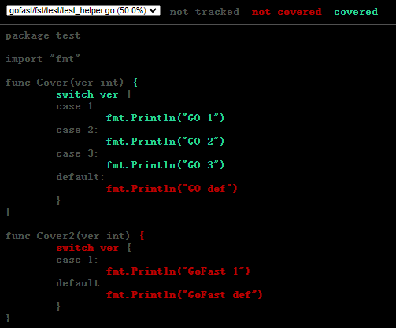

# 单元测试

## 什么是单元测试
百度百科：单元测试（unit testing），是指对软件中的最小可测试单元进行检查和验证。对于单元测试中单元的含义，一般来说，要根据实际情况去判定其具体含义，如C语言中单元指一个函数，Java里单元指一个类，图形化的软件中可以指一个窗口或一个菜单等。总的来说，单元就是人为规定的最小的被测功能模块。单元测试是在软件开发过程中要进行的最低级别的测试活动，软件的独立单元将在与程序的其他部分相隔离的情况下进行测试。

单元测试是由程序员自己来完成，最终受益的也是程序员自己。可以这么说，程序员有责任编写功能代码，同时也就有责任为自己的代码编写单元测试。执行单元测试，就是为了证明这段代码的行为和我们期望的一致；更重要的是一旦你修改了陈年已久的代码，复杂的嵌套和逻辑，你可能一时半会儿不知道自己会不会改出幺蛾子；此时你要有丰富的单元测试案例的话，只需要运行一个命令等着看结果就好了。

## 简单单元测试

找个地方编写下面的单元测试用例：

```azure
// gofast/fst/test/helper_test.go
func fullName(first string, second string) string {
	return fmt.Sprintf("%s %s", first, second)
}

func TestFullName(t *testing.T) {
	full := fullName("chen", "de")

	if full == "chen de" {
		t.Log("The testing passed.")
	} else {
		t.Log("The testing not passed.")
	}
}
```
在当前文件所在目录的控制台运行：go test -v
```azure
=== RUN   TestFullName
    helper_test.go:23: The testing passed.
--- PASS: TestFullName (0.00s)
PASS
ok      gofast/fst/test 0.140s
```

上面的测试用了Go语言内置的测试框架，怎么样？是不是简单方便。这里不得不说，使用过程中需要注意如下几点：

- 含测试代码的go文件必须以_test.go结尾，Go语言测试工具只取符合这个规则的文件。
- 单元测试文件名_test.go前面的部分最好是被测试的方法所在go文件的文件名；更能体现单元测试的要义。
- 函数名最好是Test+要测试的方法函数名，比如例子中是TestFullName，测试的是fullName这个函数。
- 单元测试的函数名必须以Test开头，是可导出公开的函数。
- 测试函数的形参必须接收一个指向testing.T类型的指针，并且不能返回任何值。
- 符合这些条件我们就能随时编写单元测试用例了。单元测试的重点是尽量多想一些特殊的情况，以便测试的更全面，最终保证程序的稳定性。

为了简化测试代码，有三方库提取出公共的测试函数，方便编写测试用例，比如：https://github.com/stretchr/testify，这里我们用这个包改写上面的测试用例：

```azure
import (
	"fmt"
	"github.com/stretchr/testify/assert"
	"testing"
)

func fullName(first string, second string) string {
	return fmt.Sprintf("%s %s", first, second)
}

func TestFullName(t *testing.T) {
	full := fullName("chen", "de")
	assert.Equal(t, "chen de", full)
}
```

执行go test -v，运行结果：

```azure
=== RUN   TestFullName
--- PASS: TestFullName (0.00s)
PASS
ok      gofast/fst/test 0.139s
```
这样代码就简单多了。失败的情况，日志会打印详细信息。更多实用函数，大家可以自行查阅。

## 模拟调用
有些单元测试情况特殊，我们无法完全模拟测试的上下文场景，比如网络访问等。这时候模拟网络访问就有必要了，为此标准库提供了一个httptest包，可以让我们模拟http的网络调用，看下面的测试用例：

```azure
func execReq(app *fst.GoFast, method, path string) *httptest.ResponseRecorder {
	app.ReadyToListen()
	req := httptest.NewRequest(method, path, nil)
	w := httptest.NewRecorder()
	app.ServeHTTP(w, req)
	return w
}

func TestRouterMethod(t *testing.T) {
	router := fst.Default()
	router.Put("/hey", func(c *fst.Context) {
		c.String(http.StatusOK, "chen de")
	})
	w := execReq(router, http.MethodPut, "/hey")
	assert.Equal(t, http.StatusOK, w.Code)
	assert.Equal(t, "chen de", w.Body.String())
}
```

这里主要利用httptest.NewRequest()创建一个新连接，httptest.NewRecorder()创建一个http.ResponseWriter来模拟响应。最后再用app.ServeHTTP(w, req)触发响应。

还有一种模拟一个真实服务器的方法来测试。

```azure
// 模拟网络请求2
func newServer() *httptest.Server {
	handler := func(rw http.ResponseWriter, r *http.Request) {
		u := struct {
			Name string
		}{
			Name: "闪电侠",
		}

		rw.Header().Set("Content-Type", "application/json")
		rw.WriteHeader(http.StatusOK)
		_ = json.NewEncoder(rw).Encode(u)
	}
	return httptest.NewServer(http.HandlerFunc(handler))
}

func TestSendJSONData(t *testing.T) {
	server := newServer()
	defer server.Close()

	res, err := http.Get(server.URL)
	if err != nil {
		t.Fatal("Get请求失败")
	}
	defer res.Body.Close()

	log.Println("Status code: ", res.StatusCode)
	jsonData, err := ioutil.ReadAll(res.Body)
	if err != nil {
		log.Fatal(err)
	}
	log.Printf("Body: %s", jsonData)
}
```
httptest.NewServer()创建的模拟服务器，默认监听的是本机IP127.0.0.1，端口随机。接下来发送Get请求到模拟服务器的地址server.URL。这样模拟真实Server的创建和调用过程就完成了。因为handler是同一个，所以请求啥地址都会返回同样的结果。

## 测试覆盖率
测试目的是为了尽可能多的发现bug，而不是证明代码没有bug；事实上你永远无法证明代码没有bug。为了减少bug就多测试，尽量把所有代码都测试充分，于是就产生了“测试覆盖率”的概念。

测试覆盖率是通过执行某包的测试用例来确认代码被执行的程度。

代码覆盖率不一定完全精准，但是可以作为参考。go test工具，就为我们提供了这么一个度量测试覆盖率的能力。如何计算测试覆盖率呢？也很简单，还是测试命令，只不过加上-cover 或者 -coverprofile=c.out（详细信息输出到文件c.out）参数。

```azure
// test_helper.go
package test
import "fmt"
func Cover(ver int) {
	switch ver {
	case 1:
		fmt.Println("GO 1")
	case 2:
		fmt.Println("GO 2")
	case 3:
		fmt.Println("GO 3")
	default:
		fmt.Println("GO def")
	}
}
func Cover2(ver int) {
	switch ver {
	case 1:
		fmt.Println("GoFast 1")
	default:
		fmt.Println("GoFast def")
	}
}

// helper_test.go
func TestCover(t *testing.T) {
	Cover(1)
	Cover(2)
	Cover(3)
}
```

在这两个文件所在目录执行：go test . -coverprofile=c.out，下面的结果：

```azure
ok      gofast/fst/test 0.225s  coverage: 50.0% of statements
```
看到没有，单元测试测试代码覆盖率为50%。我们还可以用go的工具生成报告html页面：go tool cover -html=c.out -o=tag.html 用浏览器打开生成的tag.html页面：



覆盖和没覆盖的逻辑一目了然。大家可以在TestCover函数中把不同分支的函数调用都写上，最后会看到100%的测试覆盖率。

覆盖率测试有三种模式，加上参数-covermode=[set|count|atomic]，大家可以试一试效果：

| 模式	  | 解释   |
|------|------|
|set	|缺省模式, 只记录语句是否被执行过|
|count	|记录语句被执行的次数|
|atomic	|记录语句被执行的次数，并保证在并发执行时的正确性|
总结一下测试覆盖率的特点：

- 覆盖测试的目标是当前目录下非_test.go的所有源文件代码。
- 测试工具能自动分析代码，计算有逻辑意义的分支总数，而不仅仅是源代码的行数。

## 总结
单元测试非常重要，特别是长期项目、大型软件产品等尤其要强调单元测试。可能有些线上产品很稳定，可是时间长了，特别是人员流动又比较频繁的情况下，没人能知道里面有什么鬼，都不敢动这些代码。有了完善的单元测试用例，能杜绝很多隐患。

很多小公司不强调单元测试，这和很多因素有关系。但我们程序员自己需要提高对单元测试的认知。
